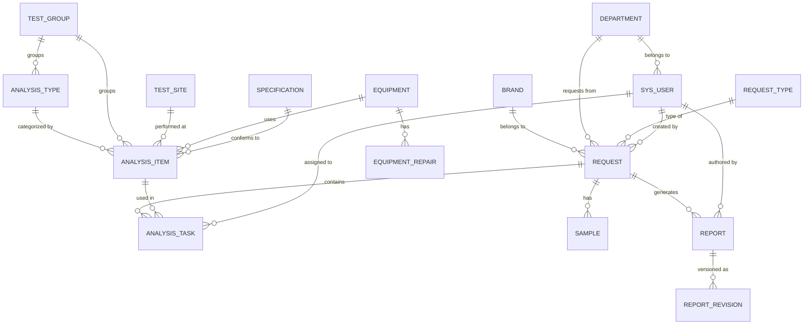

# Material LIMS 技术方案设计文档

> 版本：1.0 | 日期：2026-06-04 | 状态：初稿

---

## 1. 系统架构设计

### 1.1 整体分层架构

系统采用经典的前后端分离架构，分为前端展示层、API网关层、应用服务层和数据存储层四个层次。

```
┌──────────────────────────────────────────────────────────────────┐
│                         前端展示层 (React SPA)                     │
│                                                                   │
│  Umi.js 4 (路由/构建) │ Ant Design Pro 6 (UI框架)                │
│  ProTable / ProForm (数据表格/表单) │ ECharts (图表)             │
│  i18next (国际化) │ Microsoft 365 iframe (报告在线编辑)           │
└────────────────────────────┬─────────────────────────────────────┘
                             │ HTTPS / REST API
┌────────────────────────────▼─────────────────────────────────────┐
│                       API网关层 (Spring Cloud Gateway)            │
│                                                                    │
│  路由转发 │ JWT鉴权 │ 限流 │ 请求日志 │ CORS处理                  │
└────────────────────────────┬─────────────────────────────────────┘
                             │
┌────────────────────────────▼─────────────────────────────────────┐
│                      应用服务层 (Spring Boot 3.2.x)               │
│                                                                    │
│  ┌────────────┐ ┌────────────┐ ┌────────────┐ ┌──────────────┐  │
│  │  基础数据   │ │  委托流程   │ │  报告管理   │ │  设备管理    │  │
│  │  Service   │ │  Service   │ │  Service   │ │  Service    │  │
│  └────────────┘ └────────────┘ └────────────┘ └──────────────┘  │
│  ┌────────────┐ ┌────────────┐ ┌────────────┐ ┌──────────────┐  │
│  │  集成服务   │ │  仪表盘    │ │  权限服务   │ │  通知服务    │  │
│  │  Service   │ │  Service   │ │  Service   │ │  Service    │  │
│  └────────────┘ └────────────┘ └────────────┘ └──────────────┘  │
│                                                                    │
│  Flowable 7 (工作流引擎) │ Spring Security (安全框架)             │
│  poi-tl (报告模板) │ Microsoft Graph SDK (M365集成)               │
│  Spring Scheduling (定时同步) │ Resilience4j (熔断降级)           │
└───────┬──────────────┬──────────────┬──────────────┬─────────────┘
        │              │              │              │
 ┌──────▼───┐   ┌──────▼───┐   ┌─────▼────┐  ┌─────▼──────┐
 │PostgreSQL │   │  Redis   │   │  MinIO   │  │LibreOffice │
 │   15.x    │   │   7.x   │   │          │  │ Headless   │
 └──────────┘   └──────────┘   └──────────┘  └────────────┘
```

### 1.2 技术栈版本锁定

| 层级 | 组件 | 版本 | 选型理由 |
|------|------|------|----------|
| 运行时 | Java | 17 LTS | 长期支持版本，Spring Boot 3.x 最低要求 |
| 后端框架 | Spring Boot | 3.2.x | 最新稳定版，原生支持 GraalVM、Virtual Threads |
| 工作流 | Flowable | 7.0.x | 兼容 Spring Boot 3，BPMN 2.0 标准实现 |
| 安全 | Spring Security | 6.2.x | 与 Spring Boot 3 绑定，OAuth2 资源服务器原生支持 |
| ORM | MyBatis-Plus | 3.5.x | 简化 CRUD，支持多租户、乐观锁插件 |
| API文档 | SpringDoc OpenAPI | 2.3.x | 替代 Swagger，原生支持 Spring Boot 3 |
| 连接池 | HikariCP | 5.x | Spring Boot 默认，性能最优 |
| 熔断 | Resilience4j | 2.x | 轻量级，替代 Hystrix |
| 前端框架 | React | 18.x | 生态成熟，Ant Design Pro 原生支持 |
| UI组件库 | Ant Design | 5.x | 企业级组件丰富，Design Token 支持定制 |
| 企业模板 | Ant Design Pro | 6.x | 开箱即用的中后台模板，ProTable/ProForm |
| 前端框架 | Umi.js | 4.x | 企业级 React 框架，约定式路由 |
| 图表 | ECharts | 5.x | 仪表盘数据可视化，支持图表联动 |
| 国际化 | i18next | 23.x | React 国际化标准方案 |
| 数据库 | PostgreSQL | 15.x | 企业级关系型数据库，JSONB/全文搜索 |
| 缓存 | Redis | 7.x | 会话管理、数据缓存、分布式锁 |
| 对象存储 | MinIO | latest | S3 兼容协议，内网部署，存储报告/附件 |
| 文档转换 | LibreOffice Headless | 7.x | Word → PDF 转换，内网无需外部服务 |
| 构建工具 | Maven | 3.9.x | 后端构建 |
| 前端构建 | Node.js | 20 LTS | 前端构建运行时 |
| 容器化 | Docker | 24.x | 统一部署环境 |

### 1.3 模块依赖关系

模块间的依赖决定了开发顺序和集成策略：

```
基础数据模块 ────────────── 无外部依赖，最先开发
    │
    ▼
权限/认证模块 ───────────── 依赖 Azure AD 配置
    │
    ▼
委托流程模块 ────────────── 依赖基础数据 + Flowable + 权限
    │
    ├──▶ 报告管理模块 ────── 依赖委托流程 + M365集成
    │
    ├──▶ 仪表盘模块 ──────── 依赖委托流程 + 设备管理数据
    │
    └──▶ 集成服务模块 ────── 依赖认证配置，可与流程模块并行

设备管理模块 ────────────── 依赖基础数据，相对独立，可并行开发
```

### 1.4 项目工程结构

**后端工程结构**（Maven 多模块）：

```
material-lims/
├── lims-common/                  # 通用模块（工具类、常量、异常定义）
├── lims-model/                   # 数据模型（Entity、DTO、VO、枚举）
├── lims-dao/                     # 数据访问层（Mapper、Repository）
├── lims-service/                 # 业务逻辑层
│   ├── src/.../basic/            # 基础数据服务
│   ├── src/.../request/          # 委托流程服务
│   ├── src/.../report/           # 报告管理服务
│   ├── src/.../equipment/        # 设备管理服务
│   ├── src/.../integration/      # 外部集成服务
│   ├── src/.../dashboard/        # 仪表盘服务
│   └── src/.../auth/             # 认证授权服务
├── lims-workflow/                # Flowable工作流模块
├── lims-web/                     # Web层（Controller、拦截器、全局异常处理）
└── lims-admin/                   # 系统管理模块（用户、日志、i18n）
```

**前端工程结构**（Umi.js 约定式）：

```
lims-web-ui/
├── src/
│   ├── pages/                    # 页面组件
│   │   ├── basic-data/           # 基础数据管理页面
│   │   ├── test-data/            # 测试数据管理页面
│   │   ├── request/              # 委托管理页面
│   │   ├── report/               # 报告管理页面
│   │   ├── equipment/            # 设备管理页面
│   │   ├── dashboard/            # 仪表盘页面
│   │   ├── knowledge/            # 知识库页面
│   │   └── admin/                # 系统管理页面
│   ├── components/               # 公共组件
│   ├── services/                 # API 调用封装
│   ├── stores/                   # 状态管理
│   ├── locales/                  # 国际化资源
│   │   ├── zh-CN.ts
│   │   └── en-US.ts
│   ├── utils/                    # 工具函数
│   └── access.ts                 # 权限控制配置
├── config/                       # Umi 配置
│   ├── routes.ts                 # 路由配置
│   └── proxy.ts                  # 开发代理配置
└── package.json
```

---

## 2. 数据库详细设计

### 2.1 ER 关系图



### 2.2 通用设计约定

- 主键：`id` 字段使用 UUID，Java 端以 `String` 类型映射
- 审计字段：所有业务表包含 `created_at`、`updated_at`、`created_by`、`updated_by`
- 逻辑删除：`deleted_at` 字段（nullable），非 null 表示已删除
- 乐观锁：核心业务表包含 `version` 字段，更新时自动递增
- 外键：物理外键不创建（仅逻辑外键），通过应用层保证数据一致性
- 命名规范：表名蛇形小写（snake_case），字段名蛇形小写

### 2.3 基础数据表

#### brand（品牌）

| 字段 | 类型 | 约束 | 说明 |
|------|------|------|------|
| id | UUID | PK | 主键 |
| name | VARCHAR(100) | NOT NULL, UNIQUE | 品牌名称（如 Scania, Hero, Scania&Hero） |
| description | TEXT | | 描述 |
| sort_order | INTEGER | DEFAULT 0 | 排序号 |
| created_by | UUID | | 创建人 |
| updated_by | UUID | | 更新人 |
| created_at | TIMESTAMP | DEFAULT NOW() | 创建时间 |
| updated_at | TIMESTAMP | DEFAULT NOW() | 更新时间 |
| deleted_at | TIMESTAMP | | 删除时间（逻辑删除） |

#### request_type（委托类型）

| 字段 | 类型 | 约束 | 说明 |
|------|------|------|------|
| id | UUID | PK | 主键 |
| name | VARCHAR(100) | NOT NULL, UNIQUE | 委托类型名称 |
| task_duration_days | INTEGER | NOT NULL | 标准测试周期（工作日） |
| part_info_required | BOOLEAN | DEFAULT TRUE | 是否需要零件信息 |
| description | TEXT | | 描述 |
| sort_order | INTEGER | DEFAULT 0 | 排序号 |
| created_by | UUID | | |
| updated_by | UUID | | |
| created_at | TIMESTAMP | DEFAULT NOW() | |
| updated_at | TIMESTAMP | DEFAULT NOW() | |
| deleted_at | TIMESTAMP | | |

#### holiday（节假日）

| 字段 | 类型 | 约束 | 说明 |
|------|------|------|------|
| id | UUID | PK | 主键 |
| date | DATE | NOT NULL | 节假日日期 |
| name | VARCHAR(200) | NOT NULL | 节假日名称 |
| type | VARCHAR(20) | NOT NULL | 类型：NATIONAL（法定）/ COMPANY（公司自定义） |
| year | INTEGER | NOT NULL | 年度（用于批量查询） |
| created_by | UUID | | |
| updated_by | UUID | | |
| created_at | TIMESTAMP | DEFAULT NOW() | |
| updated_at | TIMESTAMP | DEFAULT NOW() | |
| deleted_at | TIMESTAMP | | |

约束：`UNIQUE(date, type)`

#### request_note（委托备注）

| 字段 | 类型 | 约束 | 说明 |
|------|------|------|------|
| id | UUID | PK | 主键 |
| content | TEXT | NOT NULL | 备注内容（支持多行） |
| is_active | BOOLEAN | DEFAULT TRUE | 是否启用 |
| sort_order | INTEGER | DEFAULT 0 | 排序号 |
| created_by | UUID | | |
| updated_by | UUID | | |
| created_at | TIMESTAMP | DEFAULT NOW() | |
| updated_at | TIMESTAMP | DEFAULT NOW() | |
| deleted_at | TIMESTAMP | | |

备注内容示例（按需求文档）：
- Brand: 如果零件是Scania和Hero共用的，请选"Scania&Hero"
- Request type: 与生产相关的紧急测试请选择"Urgent request"
- Request reason: 委托原因应尽可能详细，如有规定的测试项目可以写明
- Part delivery: Please send parts to 527...

#### department（部门）

| 字段 | 类型 | 约束 | 说明 |
|------|------|------|------|
| id | UUID | PK | 主键 |
| name | VARCHAR(200) | NOT NULL | 部门名称 |
| parent_id | UUID | FK → department.id | 上级部门（顶级为 NULL） |
| external_id | VARCHAR(100) | | Azure AD 中的部门标识 |
| level | INTEGER | DEFAULT 1 | 层级深度 |
| sort_order | INTEGER | DEFAULT 0 | 同级排序 |
| created_by | UUID | | |
| updated_by | UUID | | |
| created_at | TIMESTAMP | DEFAULT NOW() | |
| updated_at | TIMESTAMP | DEFAULT NOW() | |
| deleted_at | TIMESTAMP | | |

#### knowledge_doc（知识库文档）

| 字段 | 类型 | 约束 | 说明 |
|------|------|------|------|
| id | UUID | PK | 主键 |
| title | VARCHAR(500) | NOT NULL | 文档标题 |
| category | VARCHAR(20) | NOT NULL | 分类：MANUAL（操作手册）/ VIDEO（视频） |
| file_url | VARCHAR(1000) | NOT NULL | MinIO 文件地址 |
| file_size | BIGINT | | 文件大小（字节） |
| description | TEXT | | 描述 |
| created_by | UUID | | |
| updated_by | UUID | | |
| created_at | TIMESTAMP | DEFAULT NOW() | |
| updated_at | TIMESTAMP | DEFAULT NOW() | |
| deleted_at | TIMESTAMP | | |

### 2.4 测试数据表

#### test_group（测试组）

| 字段 | 类型 | 约束 | 说明 |
|------|------|------|------|
| id | UUID | PK | 主键 |
| name | VARCHAR(100) | NOT NULL, UNIQUE | 测试组名称 |
| description | TEXT | | 描述 |
| sort_order | INTEGER | DEFAULT 0 | |
| created_by | UUID | | |
| updated_by | UUID | | |
| created_at | TIMESTAMP | DEFAULT NOW() | |
| updated_at | TIMESTAMP | DEFAULT NOW() | |
| deleted_at | TIMESTAMP | | |

#### test_site（测试站点）

| 字段 | 类型 | 约束 | 说明 |
|------|------|------|------|
| id | UUID | PK | 主键 |
| name | VARCHAR(100) | NOT NULL, UNIQUE | 站点名称 |
| location | VARCHAR(500) | | 物理位置 |
| description | TEXT | | |
| sort_order | INTEGER | DEFAULT 0 | |
| created_by | UUID | | |
| updated_by | UUID | | |
| created_at | TIMESTAMP | DEFAULT NOW() | |
| updated_at | TIMESTAMP | DEFAULT NOW() | |
| deleted_at | TIMESTAMP | | |

#### analysis_type（分析类型）

| 字段 | 类型 | 约束 | 说明 |
|------|------|------|------|
| id | UUID | PK | 主键 |
| group_id | UUID | NOT NULL, FK → test_group.id | 所属测试组 |
| name | VARCHAR(200) | NOT NULL | 分析类型名称 |
| description | TEXT | | 描述 |
| sort_order | INTEGER | DEFAULT 0 | |
| created_by | UUID | | |
| updated_by | UUID | | |
| created_at | TIMESTAMP | DEFAULT NOW() | |
| updated_at | TIMESTAMP | DEFAULT NOW() | |
| deleted_at | TIMESTAMP | | |

#### analysis_item（分析项目）—— 最复杂的配置表

| 字段 | 类型 | 约束 | 说明 |
|------|------|------|------|
| id | UUID | PK | 主键 |
| group_id | UUID | NOT NULL, FK → test_group.id | 所属测试组 |
| site_id | UUID | FK → test_site.id | 测试站点 |
| type_id | UUID | NOT NULL, FK → analysis_type.id | 分析类型 |
| name | VARCHAR(200) | NOT NULL | 分析项目名称 |
| equipment_id | UUID | FK → equipment.id | 关联设备 |
| test_standards | VARCHAR(500) | | 测试标准 |
| specification_id | UUID | FK → specification.id | 关联规格 |
| cost | DECIMAL(12,2) | | 总成本 |
| unit_price | DECIMAL(12,2) | | 单价 |
| unit | VARCHAR(50) | | 单位（如次、件、小时） |
| description | TEXT | | 描述 |
| attachment_url | VARCHAR(1000) | | 附件地址 |
| is_active | BOOLEAN | DEFAULT TRUE | 是否启用 |
| sort_order | INTEGER | DEFAULT 0 | |
| created_by | UUID | | |
| updated_by | UUID | | |
| created_at | TIMESTAMP | DEFAULT NOW() | |
| updated_at | TIMESTAMP | DEFAULT NOW() | |
| deleted_at | TIMESTAMP | | |

#### specification（规格）

| 字段 | 类型 | 约束 | 说明 |
|------|------|------|------|
| id | UUID | PK | 主键 |
| group_id | UUID | FK → test_group.id | 所属测试组 |
| name | VARCHAR(200) | NOT NULL | 规格名称 |
| unit | VARCHAR(50) | | 单位 |
| description | TEXT | | 描述 |
| sort_order | INTEGER | DEFAULT 0 | |
| created_by | UUID | | |
| updated_by | UUID | | |
| created_at | TIMESTAMP | DEFAULT NOW() | |
| updated_at | TIMESTAMP | DEFAULT NOW() | |
| deleted_at | TIMESTAMP | | |

### 2.5 核心业务表

#### request（委托单）—— 系统核心表

| 字段 | 类型 | 约束 | 说明 |
|------|------|------|------|
| id | UUID | PK | 主键 |
| request_no | VARCHAR(50) | NOT NULL, UNIQUE | 委托编号（自动生成，格式：REQ-YYYY-NNNN） |
| brand_id | UUID | NOT NULL, FK → brand.id | 品牌 |
| dept_id | UUID | FK → department.id | 委托部门 |
| type_id | UUID | NOT NULL, FK → request_type.id | 委托类型 |
| requester_id | UUID | NOT NULL, FK → sys_user.id | 委托人 |
| proxy_requester_id | UUID | FK → sys_user.id | 代下单人（代理委托时记录真实委托人，此字段记录代理操作人） |
| real_requester_name | VARCHAR(200) | | 真实委托人姓名（代下单时记录） |
| part_number | VARCHAR(200) | | 零件编号（API查询或手动输入） |
| part_name | VARCHAR(500) | | 零件名称（API回填或手动输入） |
| eco | VARCHAR(200) | | ECO编号（API回填） |
| supplier_code | VARCHAR(200) | | 供应商编号（API回填或手动输入） |
| supplier_name | VARCHAR(500) | | 供应商名称（API回填） |
| request_reason | TEXT | NOT NULL | 委托原因 |
| priority | VARCHAR(20) | NOT NULL DEFAULT 'NORMAL' | 优先级：LOW/NORMAL/HIGH/URGENT |
| status | VARCHAR(30) | NOT NULL DEFAULT 'DRAFT' | 状态（见状态机定义） |
| due_date | DATE | | 截止日期（基于 type.task_duration_days 自动计算，跳过节假日） |
| sample_delivery_note | TEXT | | 送样说明（自动加载 request_note） |
| total_cost | DECIMAL(14,2) | | 总成本（关联 analysis_task 的成本汇总） |
| process_instance_id | VARCHAR(100) | | Flowable 流程实例 ID |
| version | INTEGER | DEFAULT 0 | 乐观锁版本号 |
| created_by | UUID | | |
| updated_by | UUID | | |
| created_at | TIMESTAMP | DEFAULT NOW() | |
| updated_at | TIMESTAMP | DEFAULT NOW() | |
| deleted_at | TIMESTAMP | | |

**request.status 状态机**：

```
DRAFT ──submit──▶ SUBMITTED ──assign──▶ ASSIGNED ──receive──▶ SAMPLING
                     │                                          │
                 reject                                   prepare
                     │                                          │
                     ▼                                          ▼
                 REJECTED                                  REPORTING ──submit_report──▶ APPROVING
                                                                              │
                                                                         approve/reject
                                                                              │
                                                                              ▼
                                                                         COMPLETED / 退回 REPORTING
```

#### analysis_task（分析任务）

| 字段 | 类型 | 约束 | 说明 |
|------|------|------|------|
| id | UUID | PK | 主键 |
| request_id | UUID | NOT NULL, FK → request.id | 所属委托单 |
| item_id | UUID | NOT NULL, FK → analysis_item.id | 分析项目 |
| assignee_id | UUID | FK → sys_user.id | 负责工程师 |
| status | VARCHAR(20) | NOT NULL DEFAULT 'PENDING' | 状态：PENDING/IN_PROGRESS/DELAYED/COMPLETED |
| delay_reason | TEXT | | 延期原因（延期时必填） |
| started_at | TIMESTAMP | | 开始时间 |
| completed_at | TIMESTAMP | | 完成时间 |
| sort_order | INTEGER | DEFAULT 0 | |
| version | INTEGER | DEFAULT 0 | 乐观锁 |
| created_by | UUID | | |
| updated_by | UUID | | |
| created_at | TIMESTAMP | DEFAULT NOW() | |
| updated_at | TIMESTAMP | DEFAULT NOW() | |
| deleted_at | TIMESTAMP | | |

#### sample（样品）

| 字段 | 类型 | 约束 | 说明 |
|------|------|------|------|
| id | UUID | PK | 主键 |
| request_id | UUID | NOT NULL, FK → request.id | 所属委托单 |
| received_by | UUID | FK → sys_user.id | 接收人（Technician） |
| received_at | TIMESTAMP | | 接收时间 |
| preparation_status | VARCHAR(20) | DEFAULT 'PENDING' | 制样状态：PENDING/PREPARING/READY |
| preparation_detail | TEXT | | 制样详情/备注 |
| completed_at | TIMESTAMP | | 制样完成时间 |
| version | INTEGER | DEFAULT 0 | 乐观锁 |
| created_by | UUID | | |
| updated_by | UUID | | |
| created_at | TIMESTAMP | DEFAULT NOW() | |
| updated_at | TIMESTAMP | DEFAULT NOW() | |
| deleted_at | TIMESTAMP | | |

#### report（报告）

| 字段 | 类型 | 约束 | 说明 |
|------|------|------|------|
| id | UUID | PK | 主键 |
| request_id | UUID | NOT NULL, FK → request.id | 所属委托单 |
| task_id | UUID | FK → analysis_task.id | 关联分析任务 |
| author_id | UUID | NOT NULL, FK → sys_user.id | 报告作者（Engineer） |
| version_number | VARCHAR(20) | NOT NULL DEFAULT 'V1.0' | 版本号（Major.Minor） |
| revision_note | TEXT | | 修改原因（Revise Report 时必填） |
| status | VARCHAR(20) | NOT NULL DEFAULT 'DRAFT' | 状态：DRAFT/IN_REVIEW/APPROVED/REVISING |
| file_url | VARCHAR(1000) | | MinIO 中 Word 文件地址 |
| pdf_url | VARCHAR(1000) | | MinIO 中 PDF 文件地址 |
| sharepoint_file_id | VARCHAR(200) | | SharePoint 文档 ID |
| sharepoint_edit_url | VARCHAR(1000) | | M365 Online 编辑 URL |
| approved_by | UUID | FK → sys_user.id | 审批人 |
| approved_at | TIMESTAMP | | 审批时间 |
| submitted_at | TIMESTAMP | | 提交审批时间 |
| version | INTEGER | DEFAULT 0 | 乐观锁 |
| created_by | UUID | | |
| updated_by | UUID | | |
| created_at | TIMESTAMP | DEFAULT NOW() | |
| updated_at | TIMESTAMP | DEFAULT NOW() | |
| deleted_at | TIMESTAMP | | |

#### report_revision（报告版本归档）

| 字段 | 类型 | 约束 | 说明 |
|------|------|------|------|
| id | UUID | PK | 主键 |
| report_id | UUID | NOT NULL, FK → report.id | 关联报告 |
| version_number | VARCHAR(20) | NOT NULL | 归档的版本号 |
| revision_note | TEXT | | 修改原因 |
| file_url | VARCHAR(1000) | | Word 文件地址 |
| pdf_url | VARCHAR(1000) | | PDF 文件地址 |
| archived_by | UUID | | 归档操作人 |
| archived_at | TIMESTAMP | DEFAULT NOW() | 归档时间 |
| created_at | TIMESTAMP | DEFAULT NOW() | |

### 2.6 设备管理表

#### equipment（设备）

| 字段 | 类型 | 约束 | 说明 |
|------|------|------|------|
| id | UUID | PK | 主键 |
| name | VARCHAR(200) | NOT NULL | 设备名称 |
| model | VARCHAR(200) | | 型号 |
| serial_number | VARCHAR(200) | | 序列号 |
| status | VARCHAR(20) | NOT NULL DEFAULT 'ACTIVE' | 状态：ACTIVE/UNDER_REPAIR/DECOMMISSIONED |
| location | VARCHAR(500) | | 存放位置 |
| purchase_date | DATE | | 购入日期 |
| warranty_expiry | DATE | | 保修截止日期 |
| description | TEXT | | 描述 |
| version | INTEGER | DEFAULT 0 | 乐观锁 |
| created_by | UUID | | |
| updated_by | UUID | | |
| created_at | TIMESTAMP | DEFAULT NOW() | |
| updated_at | TIMESTAMP | DEFAULT NOW() | |
| deleted_at | TIMESTAMP | | |

#### equipment_repair（设备维修记录）

| 字段 | 类型 | 约束 | 说明 |
|------|------|------|------|
| id | UUID | PK | 主键 |
| equipment_id | UUID | NOT NULL, FK → equipment.id | 关联设备 |
| report_date | DATE | NOT NULL | 报修日期 |
| fault_description | TEXT | NOT NULL | 故障描述 |
| repair_action | TEXT | | 维修措施 |
| repair_cost | DECIMAL(12,2) | | 维修费用 |
| repaired_by | VARCHAR(200) | | 维修人/单位 |
| completion_date | DATE | | 完工日期 |
| status | VARCHAR(20) | NOT NULL DEFAULT 'REPORTING' | 状态：REPORTING/REPAIRING/COMPLETED |
| version | INTEGER | DEFAULT 0 | 乐观锁 |
| created_by | UUID | | |
| updated_by | UUID | | |
| created_at | TIMESTAMP | DEFAULT NOW() | |
| updated_at | TIMESTAMP | DEFAULT NOW() | |
| deleted_at | TIMESTAMP | | |

### 2.7 系统表

#### sys_user（系统用户）

| 字段 | 类型 | 约束 | 说明 |
|------|------|------|------|
| id | UUID | PK | 主键 |
| email | VARCHAR(200) | NOT NULL, UNIQUE | 邮箱（登录标识） |
| display_name | VARCHAR(200) | NOT NULL | 显示名称 |
| login_id | VARCHAR(200) | | 登录ID（AD同步） |
| dept_id | UUID | FK → department.id | 所属部门 |
| roles | VARCHAR(100) | DEFAULT 'REQUESTER' | 角色列表（逗号分隔，如 REQUESTER,ENGINEER） |
| external_id | VARCHAR(200) | | Azure AD 用户 Object ID |
| is_active | BOOLEAN | DEFAULT TRUE | 是否启用 |
| last_login_at | TIMESTAMP | | 最后登录时间 |
| created_at | TIMESTAMP | DEFAULT NOW() | |
| updated_at | TIMESTAMP | DEFAULT NOW() | |

#### sys_operation_log（操作日志）

| 字段 | 类型 | 约束 | 说明 |
|------|------|------|------|
| id | UUID | PK | 主键 |
| user_id | UUID | FK → sys_user.id | 操作人 |
| module | VARCHAR(50) | NOT NULL | 模块名（如 REQUEST, REPORT, EQUIPMENT） |
| action | VARCHAR(20) | NOT NULL | 操作类型：CREATE/UPDATE/DELETE/APPROVE/REJECT |
| entity_id | VARCHAR(100) | | 操作实体 ID |
| detail | JSONB | | 变更详情（old/new 值对比） |
| ip | VARCHAR(50) | | 操作 IP |
| created_at | TIMESTAMP | DEFAULT NOW() | |

此表按月分区（`PARTITION BY RANGE (created_at)`），避免单表过大。

#### sys_i18n_message（国际化消息）

| 字段 | 类型 | 约束 | 说明 |
|------|------|------|------|
| id | UUID | PK | 主键 |
| message_key | VARCHAR(200) | NOT NULL | 消息键（如 menu.request.list） |
| locale | VARCHAR(10) | NOT NULL | 语言标识：zh-CN / en-US |
| message_value | TEXT | NOT NULL | 翻译文本 |
| created_at | TIMESTAMP | DEFAULT NOW() | |
| updated_at | TIMESTAMP | DEFAULT NOW() | |

约束：`UNIQUE(message_key, locale)`

### 2.8 索引设计

**关键索引**（非主键/唯一约束索引）：

```sql
-- request 表
CREATE INDEX idx_request_requester ON request(requester_id) WHERE deleted_at IS NULL;
CREATE INDEX idx_request_status ON request(status) WHERE deleted_at IS NULL;
CREATE INDEX idx_request_brand ON request(brand_id) WHERE deleted_at IS NULL;
CREATE INDEX idx_request_due_date ON request(due_date) WHERE deleted_at IS NULL;
CREATE INDEX idx_request_created_at ON request(created_at DESC) WHERE deleted_at IS NULL;

-- analysis_task 表
CREATE INDEX idx_task_request ON analysis_task(request_id) WHERE deleted_at IS NULL;
CREATE INDEX idx_task_assignee ON analysis_task(assignee_id) WHERE deleted_at IS NULL;
CREATE INDEX idx_task_status ON analysis_task(status) WHERE deleted_at IS NULL;

-- report 表
CREATE INDEX idx_report_request ON report(request_id) WHERE deleted_at IS NULL;
CREATE INDEX idx_report_author ON report(author_id) WHERE deleted_at IS NULL;
CREATE INDEX idx_report_status ON report(status) WHERE deleted_at IS NULL;

-- sample 表
CREATE INDEX idx_sample_request ON sample(request_id) WHERE deleted_at IS NULL;

-- equipment_repair 表
CREATE INDEX idx_repair_equipment ON equipment_repair(equipment_id) WHERE deleted_at IS NULL;
CREATE INDEX idx_repair_status ON equipment_repair(status) WHERE deleted_at IS NULL;

-- holiday 表
CREATE INDEX idx_holiday_year ON holiday(year);

-- sys_operation_log 表
CREATE INDEX idx_log_user ON sys_operation_log(user_id);
CREATE INDEX idx_log_module ON sys_operation_log(module);
CREATE INDEX idx_log_created_at ON sys_operation_log(created_at DESC);
```

---

## 3. API 接口设计

### 3.1 通用规范

**基础路径**：`/api/v1/`

**认证方式**：Bearer Token（JWT），通过 `Authorization: Bearer <token>` 请求头传递

**请求分页**：
```
GET /api/v1/requests?page=0&size=20&sort=createdAt,desc
```

**统一响应格式**：

```json
{
  "code": 200,
  "message": "success",
  "data": {},
  "timestamp": "2026-06-04T10:30:00Z"
}
```

**分页响应格式**：

```json
{
  "code": 200,
  "message": "success",
  "data": {
    "content": [],
    "totalElements": 100,
    "totalPages": 5,
    "size": 20,
    "number": 0
  },
  "timestamp": "2026-06-04T10:30:00Z"
}
```

**错误码定义**：

| 范围 | 含义 | 示例 |
|------|------|------|
| 1000-1999 | 通用错误 | 1001=参数校验失败, 1002=数据不存在, 1003=数据已存在 |
| 2000-2999 | 业务错误 | 2001=委托状态不允许此操作, 2002=报告版本冲突, 2003=Due Date已过期 |
| 3000-3999 | 权限错误 | 3001=未认证, 3002=无权限, 3003=Token过期 |
| 5000-5999 | 系统错误 | 5001=外部API不可用, 5002=文件转换失败, 5003=M365集成异常 |

**国际化**：通过 `Accept-Language: zh-CN` 或 `Accept-Language: en-US` 请求头切换

### 3.2 认证模块

| 方法 | 路径 | 说明 | 权限 |
|------|------|------|------|
| GET | `/api/v1/auth/azure-ad-login` | 获取 Azure AD 登录跳转 URL | 公开 |
| GET | `/api/v1/auth/callback` | Azure AD 认证回调，换取 JWT | 公开 |
| POST | `/api/v1/auth/logout` | 登出，清除会话 | 已认证 |
| GET | `/api/v1/auth/me` | 获取当前用户信息及权限 | 已认证 |
| PUT | `/api/v1/auth/me/locale` | 切换当前用户界面语言 | 已认证 |

### 3.3 基础数据 CRUD（6组）

每组遵循标准 RESTful CRUD 规范，以 brand 为例：

| 方法 | 路径 | 说明 | 权限 |
|------|------|------|------|
| GET | `/api/v1/brands` | 分页查询品牌列表 | 已认证 |
| GET | `/api/v1/brands/{id}` | 获取品牌详情 | 已认证 |
| POST | `/api/v1/brands` | 创建品牌 | ADMIN |
| PUT | `/api/v1/brands/{id}` | 更新品牌 | ADMIN |
| DELETE | `/api/v1/brands/{id}` | 删除品牌（逻辑删除） | ADMIN |

其余5组同理：
- `/api/v1/request-types`
- `/api/v1/holidays`（额外接口：`POST /api/v1/holidays/import` 批量导入）
- `/api/v1/request-notes`
- `/api/v1/departments`（额外接口：`GET /api/v1/departments/tree` 返回树形结构）
- `/api/v1/knowledge-docs`

### 3.4 测试数据 CRUD（5组）

标准 CRUD，路径如下：
- `/api/v1/test-groups`
- `/api/v1/test-sites`
- `/api/v1/analysis-types`
- `/api/v1/analysis-items`
- `/api/v1/specifications`

**特殊查询接口**：

| 方法 | 路径 | 说明 |
|------|------|------|
| GET | `/api/v1/analysis-items/by-group/{groupId}` | 按测试组查询分析项目 |
| GET | `/api/v1/analysis-types/by-group/{groupId}` | 按测试组查询分析类型 |
| GET | `/api/v1/analysis-items/cascade` | 三级联动数据（Group → Type → Item） |

### 3.5 委托流程接口

| 方法 | 路径 | 说明 | 权限 |
|------|------|------|------|
| POST | `/api/v1/requests` | 创建委托 | REQUESTER / 代理角色 |
| GET | `/api/v1/requests` | 分页查询（支持筛选） | 按数据权限 |
| GET | `/api/v1/requests/{id}` | 委托详情 | 按数据权限 |
| PUT | `/api/v1/requests/{id}` | 更新委托（仅 DRAFT 状态） | 创建人 |
| POST | `/api/v1/requests/{id}/submit` | 提交委托 | 创建人 |
| POST | `/api/v1/requests/{id}/assign` | Manager 分配工程师 | MANAGER |
| PUT | `/api/v1/requests/{id}/assign` | 修正委托信息 | MANAGER |
| POST | `/api/v1/requests/{id}/reject` | 拒绝/退回委托 | MANAGER |
| POST | `/api/v1/requests/{id}/receive-sample` | 接收样品 | TECHNICIAN |
| PUT | `/api/v1/requests/{id}/prepare-sample` | 更新制样状态 | TECHNICIAN |
| GET | `/api/v1/requests/{id}/timeline` | 获取流程时间线 | 按数据权限 |
| GET | `/api/v1/requests/{id}/notes` | 获取委托备注（自动加载） | 已认证 |

**查询参数**（GET /api/v1/requests）：

```
?page=0&size=20
&sort=createdAt,desc
&status=SUBMITTED,ASSIGNED          (多选)
&brandId=xxx
&typeId=xxx
&priority=HIGH,URGENT               (多选)
&requesterId=xxx
&dueDateFrom=2026-01-01
&dueDateTo=2026-12-31
&keyword=xxx                        (模糊搜索 requestNo/partNumber/partName)
```

### 3.6 分析任务接口

| 方法 | 路径 | 说明 | 权限 |
|------|------|------|------|
| GET | `/api/v1/requests/{requestId}/tasks` | 委托下的任务列表 | 按数据权限 |
| GET | `/api/v1/tasks/{id}` | 任务详情 | 按数据权限 |
| PUT | `/api/v1/tasks/{id}` | 更新任务 | 分配工程师 |
| POST | `/api/v1/tasks/{id}/start` | 开始任务 | 分配工程师 |
| POST | `/api/v1/tasks/{id}/complete` | 完成任务 | 分配工程师 |
| POST | `/api/v1/tasks/{id}/delay` | 标记延期（附原因） | 分配工程师 |

### 3.7 报告管理接口

| 方法 | 路径 | 说明 | 权限 |
|------|------|------|------|
| POST | `/api/v1/requests/{requestId}/reports` | 创建报告（生成模板） | ENGINEER |
| GET | `/api/v1/reports/{id}` | 报告详情 | 按数据权限 |
| GET | `/api/v1/reports/{id}/edit-url` | 获取 M365 在线编辑 URL | 报告作者/MANAGER |
| POST | `/api/v1/reports/{id}/sync` | 从 SharePoint 同步最新内容 | 报告作者 |
| POST | `/api/v1/reports/{id}/submit` | 提交审批 | 报告作者 |
| POST | `/api/v1/reports/{id}/approve` | 审批通过 | MANAGER |
| POST | `/api/v1/reports/{id}/reject` | 审批退回 | MANAGER |
| GET | `/api/v1/reports/{id}/download` | 下载 Word 版报告 | 按数据权限 |
| GET | `/api/v1/reports/{id}/download-pdf` | 下载 PDF 版报告 | 按数据权限 |
| POST | `/api/v1/reports/{id}/revise` | 发起版本升级 | 报告作者/MANAGER |
| GET | `/api/v1/reports/{id}/revisions` | 版本历史列表 | 按数据权限 |
| GET | `/api/v1/reports/archive` | 历史版本归档列表 | MANAGER |

### 3.8 仪表盘接口

| 方法 | 路径 | 说明 | 权限 |
|------|------|------|------|
| GET | `/api/v1/dashboard/my-tasks` | 我的工作台数据 | 已认证 |
| GET | `/api/v1/dashboard/manager-overview` | Manager 全局视图 | MANAGER |
| GET | `/api/v1/dashboard/request-stats` | Request 统计数据 | MANAGER |
| GET | `/api/v1/dashboard/cost-stats` | 成本统计 | MANAGER |
| GET | `/api/v1/dashboard/equipment-stats` | 设备统计 | 已认证 |

**request-stats 查询参数**：
```
&brandId=xxx&typeId=xxx&period=MONTH|QUARTER|YEAR&from=2026-01-01&to=2026-12-31
```

**cost-stats 查询参数**：
```
&brandId=xxx&typeId=xxx&groupBy=BRAND|TYPE|MONTH&from=2026-01-01&to=2026-12-31
```

### 3.9 设备管理接口

| 方法 | 路径 | 说明 | 权限 |
|------|------|------|------|
| GET | `/api/v1/equipments` | 设备列表 | 已认证 |
| GET | `/api/v1/equipments/{id}` | 设备详情 | 已认证 |
| POST | `/api/v1/equipments` | 创建设备 | ADMIN |
| PUT | `/api/v1/equipments/{id}` | 更新设备 | ADMIN |
| PATCH | `/api/v1/equipments/{id}/status` | 更新设备状态 | ADMIN |
| DELETE | `/api/v1/equipments/{id}` | 删除设备 | ADMIN |
| GET | `/api/v1/equipment-repairs` | 维修记录列表 | 已认证 |
| POST | `/api/v1/equipment-repairs` | 创建维修记录 | 已认证 |
| PUT | `/api/v1/equipment-repairs/{id}` | 更新维修记录 | 已认证 |
| GET | `/api/v1/equipment-repairs/{id}/print` | 获取打印数据 | 已认证 |
| GET | `/api/v1/equipment-repairs/export` | 导出维修记录（Excel） | MANAGER |

### 3.10 外部集成接口

| 方法 | 路径 | 说明 | 权限 |
|------|------|------|------|
| GET | `/api/v1/external/parts` | 零部件实时查询（代理转发） | 已认证 |
| GET | `/api/v1/external/suppliers` | 供应商实时查询（代理转发） | 已认证 |
| POST | `/api/v1/sync/users` | 手动触发人员同步 | ADMIN |
| POST | `/api/v1/sync/departments` | 手动触发部门同步 | ADMIN |
| GET | `/api/v1/sync/status` | 查看最近同步状态 | ADMIN |

---

## 4. 前端页面与路由设计

### 4.1 全局布局

采用 Ant Design Pro 的 ProLayout 布局，左侧菜单 + 顶部导航 + 内容区域。

```
┌──────────────────────────────────────────────────┐
│  Logo    Material LIMS    [语言切换] [用户名] [退出] │
├──────────┬───────────────────────────────────────┤
│          │                                        │
│ 工作台    │           内容区域                      │
│ 委托管理  │                                        │
│  ├ 列表   │                                        │
│  ├ 看板   │                                        │
│  └ 创建   │                                        │
│ 报告管理  │                                        │
│  ├ 列表   │                                        │
│  └ 归档   │                                        │
│ 设备管理  │                                        │
│  ├ 台账   │                                        │
│  ├ 状态   │                                        │
│  └ 维修   │                                        │
│ 仪表盘    │                                        │
│  ├ Request│                                        │
│  └ 成本   │                                        │
│ 基础数据  │                                        │
│ 测试数据  │                                        │
│ 知识库    │                                        │
│ 系统管理  │                                        │
│          │                                        │
└──────────┴───────────────────────────────────────┘
```

菜单根据角色动态显示，普通工程师只看到工作台、委托管理（自己的）、报告管理（自己的）；Manager 看到全部；Admin 额外看到基础数据、测试数据、系统管理。

### 4.2 路由表

```typescript
// config/routes.ts
export default [
  {
    path: '/login',
    component: './Login',
    layout: false,
  },
  {
    path: '/',
    redirect: '/workspace',
  },
  {
    path: '/workspace',
    name: 'workspace',
    icon: 'DesktopOutlined',
    component: './Workspace',
    // 工作台：根据角色展示不同内容
  },
  // === 委托管理 ===
  {
    path: '/request',
    name: 'request',
    icon: 'FormOutlined',
    routes: [
      {
        path: '/request/list',
        name: 'list',
        component: './request/RequestList',
      },
      {
        path: '/request/create',
        name: 'create',
        component: './request/RequestCreate',
        hideInMenu: true,
      },
      {
        path: '/request/:id',
        name: 'detail',
        component: './request/RequestDetail',
        hideInMenu: true,
      },
      {
        path: '/request/kanban',
        name: 'kanban',
        component: './request/RequestKanban',
      },
    ],
  },
  // === 报告管理 ===
  {
    path: '/report',
    name: 'report',
    icon: 'FileTextOutlined',
    routes: [
      {
        path: '/report/list',
        name: 'list',
        component: './report/ReportList',
      },
      {
        path: '/report/:id',
        name: 'detail',
        component: './report/ReportDetail',
        hideInMenu: true,
      },
      {
        path: '/report/:id/edit',
        name: 'edit',
        component: './report/ReportEdit',
        hideInMenu: true,
      },
      {
        path: '/report/:id/revisions',
        name: 'revisions',
        component: './report/ReportRevisions',
        hideInMenu: true,
      },
      {
        path: '/report/archive',
        name: 'archive',
        component: './report/ReportArchive',
        access: 'canManager',
      },
    ],
  },
  // === 设备管理 ===
  {
    path: '/equipment',
    name: 'equipment',
    icon: 'ToolOutlined',
    routes: [
      {
        path: '/equipment/list',
        name: 'list',
        component: './equipment/EquipmentList',
      },
      {
        path: '/equipment/status',
        name: 'status',
        component: './equipment/EquipmentStatus',
      },
      {
        path: '/equipment/repairs',
        name: 'repairs',
        component: './equipment/EquipmentRepairs',
      },
    ],
  },
  // === 仪表盘 ===
  {
    path: '/dashboard',
    name: 'dashboard',
    icon: 'DashboardOutlined',
    access: 'canManager',
    routes: [
      {
        path: '/dashboard/request',
        name: 'requestStats',
        component: './dashboard/RequestDashboard',
      },
      {
        path: '/dashboard/cost',
        name: 'costStats',
        component: './dashboard/CostDashboard',
      },
    ],
  },
  // === 基础数据 ===
  {
    path: '/basic-data',
    name: 'basicData',
    icon: 'DatabaseOutlined',
    access: 'canAdmin',
    routes: [
      { path: '/basic-data/brands', name: 'brands', component: './basic-data/BrandList' },
      { path: '/basic-data/request-types', name: 'requestTypes', component: './basic-data/RequestTypeList' },
      { path: '/basic-data/holidays', name: 'holidays', component: './basic-data/HolidayList' },
      { path: '/basic-data/request-notes', name: 'requestNotes', component: './basic-data/RequestNoteList' },
      { path: '/basic-data/departments', name: 'departments', component: './basic-data/DepartmentList' },
    ],
  },
  // === 测试数据 ===
  {
    path: '/test-data',
    name: 'testData',
    icon: 'ExperimentOutlined',
    access: 'canAdmin',
    routes: [
      { path: '/test-data/groups', name: 'groups', component: './test-data/TestGroupList' },
      { path: '/test-data/sites', name: 'sites', component: './test-data/TestSiteList' },
      { path: '/test-data/analysis-types', name: 'analysisTypes', component: './test-data/AnalysisTypeList' },
      { path: '/test-data/analysis-items', name: 'analysisItems', component: './test-data/AnalysisItemList' },
      { path: '/test-data/specifications', name: 'specifications', component: './test-data/SpecificationList' },
    ],
  },
  // === 知识库 ===
  {
    path: '/knowledge',
    name: 'knowledge',
    icon: 'BookOutlined',
    component: './knowledge/KnowledgeList',
  },
  // === 系统管理 ===
  {
    path: '/admin',
    name: 'admin',
    icon: 'SettingOutlined',
    access: 'canAdmin',
    routes: [
      { path: '/admin/users', name: 'users', component: './admin/UserList' },
      { path: '/admin/logs', name: 'logs', component: './admin/LogList' },
      { path: '/admin/i18n', name: 'i18n', component: './admin/I18nList' },
    ],
  },
];
```

### 4.3 核心页面交互流程

#### 创建委托页 (`/request/create`)

```
Step 1: 选择 Brand
    ↓ 自动加载关联 Request Type
Step 2: 选择 Request Type → 自动计算 Due Date（基于 task_duration_days + 跳过节假日）
    ↓
Step 3: 输入 Part Number（关键字）
    ↓ 实时调用 /api/v1/external/parts 查询
    ↓ 下拉展示匹配结果 → 选择后自动回填 Part Name / ECO
    ↓ 若 API 不可用，允许手动输入
Step 4: 输入 Supplier（关键字）
    ↓ 实时调用 /api/v1/external/suppliers 查询
    ↓ 下拉展示 → 选择后回填 Supplier Code / Name
Step 5: 填写 Request Reason（必填）
    ↓ 自动展示 Request Notes（只读提示区）
Step 6: 选择 Analysis Items
    ↓ Test Group → Analysis Type → Analysis Item 三级联动
    ↓ 每选一个 Item，显示其 Equipment / Test Standards / Cost
    ↓ 底部实时计算总成本
Step 7: 如为代下单，勾选"代下单"→ 额外填写真实委托人姓名
    ↓
Step 8: 提交 / 保存草稿
```

#### Manager 分配页 (`/request/:id`，Manager 视角)

```
1. 查看委托完整信息（只读）
2. 如有错误信息，点击"修正"进入编辑模式
3. 为每个 Analysis Task 分配 Engineer（下拉选择）
4. 标记优先级（LOW/NORMAL/HIGH/URGENT）
5. 操作按钮：
   - [确认分配] → 状态变为 ASSIGNED，通知各 Engineer
   - [退回] → 填写退回原因，状态回到 DRAFT
   - [拒绝] → 填写拒绝原因，状态变为 REJECTED
```

#### 报告编辑页 (`/report/:id/edit`)

```
1. 顶部：Request 基本信息摘要（编号、品牌、零件、委托原因）
2. 中部：报告内容区
   - [在线编辑] 按钮 → 打开 M365 Online Word 编辑器（iframe 或新窗口）
   - 编辑完成后点击 [同步内容] → 从 SharePoint 拉取最新版本
3. 底部：操作按钮
   - [提交审批] → 弹窗确认 → 状态变为 IN_REVIEW
   - [标记延期] → 弹窗选择延期原因 → 记录到 analysis_task
4. 右侧：版本信息面板
   - 当前版本号
   - 修改历史（如有 Revise）
```

#### Request 看板 (`/request/kanban`)

```
┌──────────┐ ┌──────────┐ ┌──────────┐ ┌──────────┐
│  待分配   │ │  进行中   │ │  待审批   │ │  已完成   │
│          │ │          │ │          │ │          │
│ REQ-001  │ │ REQ-003  │ │ REQ-005  │ │ REQ-002  │
│ Scania   │ │ Hero     │ │ Scania   │ │ Scania   │
│ ⚠ 6月6日 │ │ 6月10日   │ │ 6月4日   │ │ 5月28日   │
│          │ │ REQ-004  │ │          │ │ REQ-006  │
│ REQ-007  │ │ Scania   │ │ REQ-008  │ │ Hero     │
│ Hero 🔴  │ │ 6月8日    │ │ Hero     │ │ 5月20日   │
│ 6月3日!  │ │          │ │ 6月5日    │ │          │
└──────────┘ └──────────┘ └──────────┘ └──────────┘

颜色标识：
  🔴 红色：已超期
  ⚠ 黄色：3天内到期
  默认：正常
```

支持拖拽改变状态（需权限校验），支持筛选和搜索。

---

## 5. 工作流详细设计

### 5.1 Request 主流程（BPMN 定义）

采用 Flowable BPMN 2.0 定义委托流程，核心流程包含5个用户任务节点和3个网关。

```
[Start Event: 创建委托]
    │
    ▼
[User Task: 提交委托] ─────────── 候选人: requester / proxy
    │ submit
    ▼
[Exclusive Gateway: 提交校验]
    │
    ▼
[User Task: Manager 分配] ─────── 候选组: ROLE_MANAGER
    │                              │ reject          │ return
    │ assign                       ▼                 ▼
    ▼                         [End: Rejected]   [Back to 提交委托]
[User Task: 样品接收与制样] ─── 候选组: ROLE_TECHNICIAN
    │ receive + prepare
    ▼
[User Task: 创建报告] ────────── 候选人: task.assignee (ENGINEER)
    │ submit_report
    ▼
[User Task: 审批报告] ────────── 候选组: ROLE_MANAGER
    │ approve             │ reject
    ▼                     ▼
[End: Completed]      [Back to 创建报告]
```

**Flowable 流程变量**：

| 变量名 | 类型 | 说明 |
|--------|------|------|
| requestId | String | 委托单 ID |
| requesterId | String | 委托人 ID |
| managerId | String | 分配的 Manager ID |
| technicianIds | List<String> | Technician ID 列表 |
| engineerIds | List<String> | 各 Analysis Task 分配的 Engineer ID |
| priority | String | 优先级 |
| dueDate | Date | 截止日期 |

### 5.2 Revise Report 子流程

Revise Report 不走独立的 Flowable 流程，而是在应用层通过状态机管理：

```
报告状态为 APPROVED
    │
    ▼ Engineer/Manager 发起 Revise
[1. 验证报告状态为 APPROVED]
    │
    ▼
[2. 创建 ReportRevision 记录，归档当前版本]
    │ 归档内容: version_number, file_url, pdf_url, revision_note
    │
    ▼
[3. 版本号递增]
    │ 规则: V1.0 → V2.0（Major 递增）
    │
    ▼
[4. 创建新版本报告文件（基于上一版模板）]
    │ 报告头部自动增加 "Revision Note" 章节
    │
    ▼
[5. 报告状态变为 REVISING]
    │
    ▼
[6. Engineer 编辑新版报告]
    │
    ▼
[7. 提交审批 → Manager 审批]
    │ approve                          │ reject
    ▼                                 ▼
[8. 状态变为 APPROVED]            [退回 REVISING]
[9. 更新 Request 中的最新报告引用]
```

### 5.3 Due Date 自动计算

```java
/**
 * 基于委托类型的标准测试周期（工作日），自动计算 Due Date
 * 跳过节假日（holiday 表）和周末（周六、周日）
 */
public LocalDate calculateDueDate(LocalDate startDate, int durationDays) {
    LocalDate current = startDate;
    int remainingDays = durationDays;
    
    while (remainingDays > 0) {
        current = current.plusDays(1);
        if (isWorkday(current)) {
            remainingDays--;
        }
    }
    return current;
}

private boolean isWorkday(LocalDate date) {
    DayOfWeek dow = date.getDayOfWeek();
    if (dow == SATURDAY || dow == SUNDAY) return false;
    return !holidayRepository.existsByDateAndTypeIn(date, List.of("NATIONAL", "COMPANY"));
}
```

### 5.4 超时提醒规则

| 规则 | 触发条件 | 通知对象 | 通知方式 |
|------|----------|----------|----------|
| 黄色预警 | Due Date 前 3 个工作日 | 任务负责人 + Manager | 系统消息 |
| 橙色预警 | Due Date 前 1 个工作日 | 任务负责人 + Manager | 系统消息 + 邮件 |
| 红色告警 | Due Date 已过期 | 任务负责人 + Manager + 部门主管 | 系统消息 + 邮件 + Teams |

**实现方式**：Spring Scheduling 定时任务，每工作日 08:00 执行，扫描即将到期/已超期的 Request 和 Analysis Task。

### 5.5 节点间耗时记录

每个流程节点转换时自动记录时间戳，用于仪表盘展示和 KPI 统计：

| 记录点 | 字段 | 说明 |
|--------|------|------|
| 创建 → 提交 | request.submitted_at | 从创建到提交的耗时 |
| 提交 → 分配 | request.assigned_at | Manager 响应时间 |
| 分配 → 接收 | sample.received_at | Technician 响应时间 |
| 接收 → 制样完成 | sample.completed_at | 制样周期 |
| 制样 → 报告提交 | report.submitted_at | 报告编写周期 |
| 报告提交 → 审批 | report.approved_at | 审批周期 |

需在 request 表扩展以下字段：

```sql
ALTER TABLE request ADD COLUMN submitted_at TIMESTAMP;
ALTER TABLE request ADD COLUMN assigned_at TIMESTAMP;
```

---

## 6. 外部集成详细设计

### 6.1 Azure AD / Microsoft Graph 集成

#### 认证配置

应用注册（Azure Portal）：
- 应用类型：Web
- 重定向 URI：`https://lims.company.com/api/v1/auth/callback`
- API 权限：`User.Read.All`、`Group.Read.All`、`Sites.ReadWrite.All`（SharePoint）
- 客户端密钥：存储于应用配置（加密）

#### 人员同步流程

```
@Scheduled(cron = "0 0 * * * ?")  // 每小时整点执行
public void syncUsers() {
    // 1. 获取 Graph API Access Token（Client Credentials Flow）
    String accessToken = getGraphAccessToken();
    
    // 2. 查询所有启用用户
    List<GraphUser> graphUsers = graphClient.getUsers(accessToken,
        "$select=displayName,mail,department,jobTitle,id,userPrincipalName");
    
    // 3. 增量同步
    for (GraphUser gu : graphUsers) {
        SysUser existing = userRepository.findByExternalId(gu.getId());
        if (existing != null) {
            // 检测字段变更，执行 UPDATE
            if (hasChanges(existing, gu)) {
                updateUser(existing, gu);
            }
        } else {
            // 不存在，执行 INSERT
            createUser(gu);
        }
    }
    
    // 4. 标记已离职用户（Graph 中无但系统中有）
    List<String> graphIds = graphUsers.stream().map(GraphUser::getId).toList();
    List<SysUser> activeUsers = userRepository.findByIsActiveTrue();
    for (SysUser su : activeUsers) {
        if (su.getExternalId() != null && !graphIds.contains(su.getExternalId())) {
            su.setIsActive(false);
            userRepository.save(su);
        }
    }
    
    // 5. 记录同步日志
    syncLogRepository.save(new SyncLog("USER", "SUCCESS", graphUsers.size()));
}
```

**去重逻辑**：以 `external_id`（Azure AD Object ID）为唯一标识，`email` 作为辅助校验。

#### 部门同步流程

```
@Scheduled(cron = "0 30 * * * ?")  // 每小时30分执行
public void syncDepartments() {
    String accessToken = getGraphAccessToken();
    
    // 1. 查询组织部门结构
    List<GraphGroup> groups = graphClient.getGroups(accessToken,
        "$select=displayName,description,id,parentGroup");
    
    // 2. 多批次查询，处理分页
    // 3. 解析层级关系
    for (GraphGroup gg : groups) {
        Department existing = departmentRepository.findByExternalId(gg.getId());
        if (existing != null) {
            if (hasChanges(existing, gg)) {
                updateDepartment(existing, gg);
            }
        } else {
            createDepartment(gg);
        }
    }
    
    // 4. 维护 parent_id 层级关系
    rebuildDepartmentTree();
}
```

#### SSO 登录流程

```
用户访问 LIMS
    │
    ▼ 前端检测无 Token
重定向至 Azure AD 授权端点
    │ https://login.microsoftonline.com/{tenantId}/oauth2/v2.0/authorize
    │ ?client_id={clientId}
    │ &response_type=code
    │ &redirect_uri={callbackUrl}
    │ &scope=User.Read email openid profile
    │
    ▼ 用户登录 Azure AD
Azure AD 回调 LIMS
    │ /api/v1/auth/callback?code=xxx
    │
    ▼ 后端用 code 换取 token
POST https://login.microsoftonline.com/{tenantId}/oauth2/v2.0/token
    │ 返回 access_token + id_token
    │
    ▼ 解析 id_token 获取用户信息
从 id_token 中提取: email, name, oid (external_id)
    │
    ▼ 查找/创建 sys_user
    │
    ▼ 生成 JWT Token（LIMS 自定义）
    │ 有效期: 8小时
    │ 包含: userId, roles, deptId
    │
    ▼ 返回前端（httpOnly Cookie）
```

### 6.2 零部件实时查询

#### 代理转发架构

```
前端输入关键字
    │
    ▼ GET /api/v1/external/parts?keyword=xxx
    │
    ▼ 后端 Controller
    │   @GetMapping("/external/parts")
    │   @PreAuthorize("isAuthenticated()")
    │   public R<List<PartVO>> searchParts(@RequestParam String keyword)
    │
    ▼ 后端 Service（带熔断）
    │   @CircuitBreaker(name = "partService", fallbackMethod = "partSearchFallback")
    │   @TimeLimiter(name = "partService")
    │   public List<PartVO> searchParts(String keyword)
    │
    ▼ 调用主数据系统 API
    │   GET https://masterdata.company.com/api/parts?keyword={keyword}
    │   Headers: Authorization: Bearer {masterdata_token}
    │
    ▼ 成功: 返回零件列表
    │   [{partNumber, partName, eco, description}]
    │
    ▼ 失败/超时: 降级处理
    │   返回空列表 + 提示 "主数据系统暂不可用，可手动输入"
```

**熔断配置**（Resilience4j）：

```yaml
resilience4j:
  circuitbreaker:
    instances:
      partService:
        slidingWindowSize: 10
        failureRateThreshold: 50
        waitDurationInOpenState: 30s
        permittedNumberOfCallsInHalfOpenState: 3
  timelimiter:
    instances:
      partService:
        timeoutDuration: 3s
```

**本地缓存**（Caffeine）：

```java
@Cacheable(value = "partSearch", key = "#keyword", unless = "#result.isEmpty()")
public List<PartVO> searchParts(String keyword) { ... }
```

缓存 TTL：5分钟，最大条目：1000

### 6.3 供应商实时查询

逻辑与零部件查询一致，额外支持：
- 按编号精确查询
- 按名称模糊查询
- 按 ID 查询

```java
@GetMapping("/external/suppliers")
public R<List<SupplierVO>> searchSuppliers(
    @RequestParam(required = false) String keyword,
    @RequestParam(required = false) String code,
    @RequestParam(required = false) String id
) { ... }
```

### 6.4 集成异常处理策略

| 异常类型 | 处理方式 | 用户提示 |
|----------|----------|----------|
| API 不可用（网络错误） | 熔断降级，返回空列表 | "外部系统暂不可用，请手动输入" |
| API 超时（>3s） | 熔断降级 | 同上 |
| 认证失败（401） | 重试获取 Token（1次），仍失败则降级 | "认证异常，请联系管理员" |
| 数据格式异常 | 记录错误日志，降级 | "查询结果异常，请手动输入" |
| Graph API 同步失败 | 记录失败日志，下次重试 | 无用户感知（后台任务） |

---

## 7. Word 在线编辑集成方案

### 7.1 方案选型分析

| 方案 | 实现方式 | 内网可行性 | 编辑体验 | 开发量 | 推荐度 |
|------|----------|-----------|----------|--------|--------|
| **iframe 嵌入 SharePoint** | 前端 iframe 加载 SharePoint 文档编辑页 | 需内网能访问 SharePoint Online（M365 企业版） | 原生 Word 体验 | 低 | ★★★★★ |
| WOPI 协议 | 自建 WOPI Host，Office Online Server 预览/编辑 | 需部署 OOS（Windows Server） | 原生 Word 体验 | 高 | ★★★ |
| OnlyOffice | 自部署 OnlyOffice Document Server | 完全内网 | 接近 Word 体验 | 中 | ★★★★ |
| Graph API 直接操作 | 通过 API 上传/下载/元数据管理 | 可行 | 无法实时编辑 | 低 | ★★ |

**推荐方案**：iframe 嵌入 SharePoint Online 文档编辑页。前提条件是内网用户可通过企业网络访问 M365 云端（这是大多数 M365 企业订阅的标准配置）。

**备选方案**：若内网无法访问 M365 云端，则采用 OnlyOffice 自部署方案。

### 7.2 iframe 嵌入方案详细设计

#### 整体流程

```
┌─────────────────────────────────────────────────────────────────┐
│                         报告编辑流程                              │
│                                                                  │
│  1. 创建报告                                                     │
│     Engineer 点击 [创建报告]                                     │
│         │                                                        │
│         ▼                                                        │
│     后端: poi-tl 生成报告模板 (.docx)                            │
│     后端: 上传至 MinIO 临时存储                                   │
│     后端: 通过 Graph API 上传至 SharePoint 文档库                 │
│     后端: 获取 SharePoint 文档编辑 URL                           │
│     后端: 保存 sharepoint_file_id, sharepoint_edit_url 到 report │
│         │                                                        │
│         ▼                                                        │
│  2. 在线编辑                                                     │
│     Engineer 点击 [在线编辑]                                     │
│         │                                                        │
│         ▼                                                        │
│     前端: iframe 加载 sharepoint_edit_url                        │
│     Engineer: 在 Word Online 中编辑报告正文、结论、图片等         │
│         │                                                        │
│         ▼                                                        │
│  3. 同步与完成                                                   │
│     Engineer 点击 [同步内容] 或 [提交审批]                       │
│         │                                                        │
│         ▼                                                        │
│     后端: 通过 Graph API 下载最新版本                            │
│     后端: 保存至 MinIO (持久化)                                  │
│     后端: 生成 PDF (LibreOffice headless 转换)                   │
│     后端: 更新 report 表 (file_url, pdf_url, updated_at)        │
│         │                                                        │
│         ▼                                                        │
│  4. 审批与锁定                                                   │
│     提交审批后: 通过 Graph API 设置文档为只读                    │
│     审批通过后: 文档保持只读，仅 Revise 时解锁                   │
└─────────────────────────────────────────────────────────────────┘
```

#### SharePoint 文档库结构

```
LIMS Reports/                          # SharePoint 文档库
├── 2026/                              # 按年份
│   ├── 06/                            # 按月份
│   │   ├── REQ-2026-0001_V1.0.docx   # 文件名: {RequestNo}_V{版本}.docx
│   │   ├── REQ-2026-0002_V1.0.docx
│   │   └── REQ-2026-0001_V2.0.docx   # Revise Report 新版本
│   └── 07/
└── 2027/
```

#### Graph API 关键调用

**上传文件至 SharePoint**：

```java
public String uploadToSharePoint(String localFilePath, String requestId, String version) {
    // 1. 获取 SharePoint Site ID
    Site site = graphClient.sites("{hostname}:/sites/LIMSReports").get();
    
    // 2. 构建 SharePoint 路径
    LocalDate now = LocalDate.now();
    String remotePath = String.format("%d/%02d/%s_%s.docx", 
        now.getYear(), now.getMonthValue(), requestId, version);
    
    // 3. 上传文件（<4MB 用单次上传，>4MB 用创建上传会话）
    DriveItem item = graphClient.sites(site.id)
        .drive()
        .root()
        .itemWithPath(remotePath)
        .content(new File(localFilePath))
        .put();
    
    // 4. 返回文件 ID 和编辑 URL
    return item.id;  // sharepoint_file_id
}
```

**获取在线编辑 URL**：

```java
public String getEditUrl(String sharepointFileId) {
    // 获取文档的 WebURL
    DriveItem item = graphClient.drives("{driveId}").items(sharepointFileId).get();
    
    // 构造嵌入编辑 URL（使用 SharePoint 嵌入链接）
    // 格式: https://company.sharepoint.com/sites/LIMSReports/_layouts/15/Doc.aspx?sourcedoc={fileId}&action=edit
    return item.webUrl + "&action=edit";
}
```

**下载最新版本**：

```java
public InputStream downloadFromSharePoint(String sharepointFileId) {
    return graphClient.drives("{driveId}")
        .items(sharepointFileId)
        .content()
        .getStream();
}
```

**锁定/解锁文档**：

```java
public void lockDocument(String sharepointFileId) {
    // 设置文档为只读（通过 checkout / 权限控制）
    DriveItem item = new DriveItem();
    // 方案一：通过权限 API 设置仅查看
    // 方案二：通过 Graph API checkOut 后不允许他人编辑
}

public void unlockDocument(String sharepointFileId) {
    // Revise Report 时解锁
}
```

### 7.3 报告模板引擎（poi-tl）

#### 模板文件设计

创建 Word 模板文件 `report_template.docx`，包含以下占位符：

```
报告编号：{{reportNo}}
委托编号：{{requestNo}}
委托日期：{{requestDate}}
品牌：{{brand}}
零件编号：{{partNumber}}
零件名称：{{partName}}
ECO：{{eco}}
供应商：{{supplierName}}
委托原因：{{requestReason}}

---分析结果---

{{#analysisTasks}}
## {{analysisItem}}（{{testStandards}}）

测试站点：{{testSite}}
设备：{{equipment}}

结果：
{{result}}

{{/analysisTasks}}

{{#isRevision}}
---版本修改说明---
版本：{{versionNumber}}
修改原因：{{revisionNote}}
{{/isRevision}}
```

#### 模板生成流程

```java
public String generateReportTemplate(ReportCreateDTO dto) {
    // 1. 查询委托信息
    Request request = requestRepository.findById(dto.getRequestId());
    
    // 2. 查询分析任务
    List<AnalysisTask> tasks = taskRepository.findByRequestId(dto.getRequestId());
    
    // 3. 构建模板数据
    Map<String, Object> data = new HashMap<>();
    data.put("reportNo", generateReportNo());
    data.put("requestNo", request.getRequestNo());
    data.put("requestDate", format(request.getCreatedAt()));
    data.put("brand", request.getBrand().getName());
    data.put("partNumber", request.getPartNumber());
    data.put("partName", request.getPartName());
    data.put("eco", request.getEco());
    data.put("supplierName", request.getSupplierName());
    data.put("requestReason", request.getRequestReason());
    
    // 4. 分析任务列表
    List<Map<String, String>> taskList = tasks.stream().map(t -> {
        Map<String, String> m = new HashMap<>();
        m.put("analysisItem", t.getItem().getName());
        m.put("testStandards", t.getItem().getTestStandards());
        m.put("testSite", t.getItem().getSite().getName());
        m.put("equipment", t.getItem().getEquipment().getName());
        m.put("result", "");  // 工程师后续填写
        return m;
    }).toList();
    data.put("analysisTasks", taskList);
    
    // 5. 渲染模板
    XWPFTemplate template = XWPFTemplate.compile("templates/report_template.docx")
        .render(data);
    
    // 6. 保存至临时文件
    String tempPath = "/tmp/report_" + UUID.randomUUID() + ".docx";
    template.writeAndClose(new FileOutputStream(tempPath));
    
    return tempPath;
}
```

### 7.4 Word → PDF 转换

```java
public String convertToPdf(String docxPath) {
    // 使用 LibreOffice Headless 模式转换
    // 命令: libreoffice --headless --convert-to pdf --outdir {outputDir} {docxPath}
    
    String outputDir = Paths.get(docxPath).getParent().toString();
    ProcessBuilder pb = new ProcessBuilder(
        "libreoffice", "--headless", "--convert-to", "pdf",
        "--outdir", outputDir, docxPath
    );
    pb.redirectErrorStream(true);
    Process process = pb.start();
    
    int exitCode = process.waitFor();
    if (exitCode != 0) {
        throw new BusinessException(5002, "PDF转换失败");
    }
    
    String pdfPath = docxPath.replace(".docx", ".pdf");
    // 上传至 MinIO
    String pdfUrl = minioService.upload(pdfPath);
    
    // 将 PDF 数据回写至 report 表
    report.setPdfUrl(pdfUrl);
    
    return pdfUrl;
}
```

### 7.5 备选方案：OnlyOffice 自部署

若内网无法访问 M365 云端，采用 OnlyOffice Document Server 自部署：

**架构**：

```
┌──────────────┐     ┌──────────────────────────┐
│  LIMS 前端    │────▶│  OnlyOffice Document     │
│  (iframe)    │     │  Server (Docker)          │
│              │◀────│  Port: 8080               │
└──────────────┘     └────────────┬─────────────┘
                                  │
                     ┌────────────▼─────────────┐
                     │  OnlyOffice Callback API  │
                     │  (LIMS 后端提供)          │
                     │  /api/v1/office/callback  │
                     └────────────┬─────────────┘
                                  │
                     ┌────────────▼─────────────┐
                     │  MinIO (文件存储)         │
                     └──────────────────────────┘
```

**集成方式**：
- 前端使用 OnlyOffice JavaScript API 嵌入编辑器
- 后端提供 Callback API（文档保存回调）
- OnlyOffice 直接读写 MinIO 中的文件

---

## 8. 安全与权限设计

### 8.1 认证方案

**SSO 认证流程**（详见第6章）：

核心要素：
- 认证协议：OAuth 2.0 Authorization Code Flow + PKCE
- Token 提供方：Azure AD（Microsoft Identity Platform）
- LIMS JWT 有效期：8小时（与工作日对齐）
- Token 存储：httpOnly Cookie（防 XSS）
- Refresh Token：不使用（依赖 Azure AD Session）

**Spring Security 配置要点**：

```java
@Configuration
@EnableWebSecurity
public class SecurityConfig {
    
    @Bean
    public SecurityFilterChain filterChain(HttpSecurity http) throws Exception {
        http
            .csrf(csrf -> csrf.csrfTokenRepository(CookieCsrfTokenRepository.withHttpOnlyFalse()))
            .authorizeHttpRequests(auth -> auth
                .requestMatchers("/api/v1/auth/**").permitAll()
                .requestMatchers("/api/v1/external/**").authenticated()
                .requestMatchers("/api/v1/admin/**").hasRole("ADMIN")
                .anyRequest().authenticated()
            )
            .oauth2ResourceServer(oauth2 -> oauth2
                .jwt(jwt -> jwt.jwtAuthenticationConverter(jwtAuthenticationConverter()))
            )
            .sessionManagement(session -> session
                .sessionCreationPolicy(SessionCreationPolicy.STATELESS)
            );
        return http.build();
    }
    
    // JWT 中的 roles 映射为 Spring Security 的 GrantedAuthority
    private JwtAuthenticationConverter jwtAuthenticationConverter() {
        JwtAuthenticationConverter converter = new JwtAuthenticationConverter();
        converter.setJwtGrantedAuthoritiesConverter(jwt -> {
            String roles = jwt.getClaimAsString("roles");
            return AuthorityUtils.commaSeparatedStringToAuthorityList(roles);
        });
        return converter;
    }
}
```

### 8.2 权限矩阵

#### 功能权限

| 功能模块 | 操作 | REQUESTER | TECHNICIAN | ENGINEER | MANAGER | ADMIN |
|----------|------|-----------|------------|----------|---------|-------|
| **委托管理** | 创建委托 | ✅ | ❌ | ❌ | ✅ | ❌ |
| | 代下单 | ❌ | ✅ | ✅ | ✅ | ❌ |
| | 查看自己的委托 | ✅ | ❌ | ❌ | ❌ | ❌ |
| | 查看所有委托 | ❌ | ❌ | ❌ | ✅ | ✅ |
| | 分配/退回/拒绝 | ❌ | ❌ | ❌ | ✅ | ❌ |
| **样品管理** | 接收/制样 | ❌ | ✅ | ❌ | ❌ | ❌ |
| **报告管理** | 创建/编辑报告 | ❌ | ❌ | ✅ 自己的 | ✅ | ❌ |
| | 审批报告 | ❌ | ❌ | ❌ | ✅ | ❌ |
| | 下载报告 | ✅ 自己的 | ❌ | ✅ 自己的 | ✅ | ❌ |
| | Revise Report | ❌ | ❌ | ✅ | ✅ | ❌ |
| | 查看归档 | ❌ | ❌ | ❌ | ✅ | ✅ |
| **仪表盘** | 我的任务 | ✅ | ✅ | ✅ | ❌ | ❌ |
| | 全局视图 | ❌ | ❌ | ❌ | ✅ | ✅ |
| | 成本统计 | ❌ | ❌ | ❌ | ✅ | ✅ |
| **设备管理** | 查看 | ✅ | ✅ | ✅ | ✅ | ✅ |
| | 维护 | ❌ | ❌ | ❌ | ❌ | ✅ |
| **基础/测试数据** | 查看 | ✅ | ✅ | ✅ | ✅ | ✅ |
| | 维护 | ❌ | ❌ | ❌ | ❌ | ✅ |
| **系统管理** | 全部 | ❌ | ❌ | ❌ | ❌ | ✅ |

#### 数据权限

| 角色 | 数据范围 | 实现方式 |
|------|----------|----------|
| REQUESTER | 仅自己创建的 Request | SQL: `WHERE requester_id = currentUserId` |
| TECHNICIAN | 分配给自己的样品任务 | SQL: `WHERE id IN (SELECT request_id FROM sample WHERE received_by = currentUserId)` |
| ENGINEER | 分配给自己的 Analysis Task 及其 Report | SQL: `WHERE id IN (SELECT request_id FROM analysis_task WHERE assignee_id = currentUserId)` |
| MANAGER | 本部门 + 所负责 Brand 的所有 Request | SQL: `WHERE dept_id = currentUserDeptId OR brand_id IN (managedBrandIds)` |
| ADMIN | 无限制 | 无数据过滤 |

**实现方式**：MyBatis-Plus 数据权限拦截器

```java
@Component
public class DataPermissionInterceptor implements InnerInterceptor {
    
    @Override
    public void beforeQuery(Executor executor, MappedStatement ms, 
                           Object parameter, RowBounds rowBounds, 
                           ResultHandler resultHandler, BoundSql boundSql) {
        // 根据当前用户角色，自动拼接数据过滤条件
        SysUser currentUser = SecurityUtils.getCurrentUser();
        String originalSql = boundSql.getSql();
        
        if (currentUser.hasRole("REQUESTER") && !currentUser.hasRole("MANAGER")) {
            originalSql = addCondition(originalSql, 
                "requester_id = '" + currentUser.getId() + "'");
        }
        // ... 其他角色逻辑
        
        // 通过反射修改 boundSql
        PluginUtils.MPBoundSql mpBoundSql = PluginUtils.mpBoundSql(boundSql);
        mpBoundSql.sql(originalSql);
    }
}
```

### 8.3 审计日志

**记录范围**：所有写操作（CREATE / UPDATE / DELETE / APPROVE / REJECT / ASSIGN）

**日志内容**：

```json
{
  "userId": "uuid-xxx",
  "module": "REQUEST",
  "action": "UPDATE",
  "entityId": "req-2026-0001",
  "detail": {
    "old": { "status": "SUBMITTED", "priority": "NORMAL" },
    "new": { "status": "ASSIGNED", "priority": "HIGH" }
  },
  "ip": "192.168.1.100",
  "createdAt": "2026-06-04T10:30:00Z"
}
```

**实现方式**：AOP 切面 + 注解

```java
@Target(ElementType.METHOD)
@Retention(RetentionPolicy.RUNTIME)
public @interface AuditLog {
    String module();
    String action();
}

@Aspect
@Component
public class AuditLogAspect {
    
    @AfterReturning("@annotation(auditLog)")
    public void recordLog(JoinPoint joinPoint, AuditLog auditLog) {
        // 获取当前用户
        SysUser user = SecurityUtils.getCurrentUser();
        // 获取操作实体 ID（从方法参数中提取）
        String entityId = extractEntityId(joinPoint.getArgs());
        // 获取变更详情（对比 old/new 值）
        Map<String, Object> detail = extractChanges(joinPoint);
        
        SysOperationLog log = new SysOperationLog();
        log.setUserId(user.getId());
        log.setModule(auditLog.module());
        log.setAction(auditLog.action());
        log.setEntityId(entityId);
        log.setDetail(toJson(detail));
        log.setIp(ServletUtils.getClientIp());
        
        logRepository.save(log);
    }
}
```

**使用示例**：

```java
@AuditLog(module = "REQUEST", action = "ASSIGN")
public void assignRequest(String requestId, AssignDTO dto) { ... }
```

### 8.4 安全防护措施

| 防护项 | 措施 | 实现 |
|--------|------|------|
| SQL 注入 | 参数化查询 | MyBatis-Plus 默认 #{} 占位符，禁止 ${} 拼接 |
| XSS | 输入过滤 + 输出转义 | 前端 DOMPurify，后端全局 XSS 过滤器 |
| CSRF | Token 校验 | Spring Security CookieCsrfTokenRepository |
| 文件上传 | 类型和大小限制 | 白名单扩展名（.docx/.pdf/.jpg/.png），单文件 < 50MB |
| 敏感数据 | 加密存储 | 数据库密码等配置使用 Jasypt 加密 |
| 接口限流 | 请求频率限制 | Spring Cloud Gateway + Redis 令牌桶 |
| 操作审计 | 全写操作日志 | AOP + 注解方式（见上节） |
| 密码策略 | 不适用 | 依赖 Azure AD 统一管理 |

---

## 9. 部署架构设计

### 9.1 部署拓扑

```
┌─────────────────────────────────────────────────────────────────┐
│                        企业内网                                   │
│                                                                  │
│  ┌──────────────┐                                               │
│  │   Nginx      │──── 反向代理 + 静态资源                         │
│  │   (主备)      │     前端静态文件 (/) → /usr/share/nginx/html   │
│  │              │     API 请求 (/api) → upstream backend          │
│  └──────┬───────┘                                               │
│         │                                                        │
│    ┌────▼─────────────────────────────────────┐                  │
│    │           Upstream: backend               │                  │
│    │  ┌──────────────┐  ┌──────────────┐      │                  │
│    │  │ Spring Boot  │  │ Spring Boot  │      │                  │
│    │  │ App Node 1   │  │ App Node 2   │      │                  │
│    │  │ :8080        │  │ :8080        │      │                  │
│    │  └──────┬───────┘  └──────┬───────┘      │                  │
│    └─────────┼─────────────────┼──────────────┘                  │
│              │                 │                                  │
│     ┌────────▼─────────────────▼──────────────┐                  │
│     │              PostgreSQL 15               │                  │
│     │  ┌──────────────┐  ┌──────────────┐     │                  │
│     │  │   Primary    │──▶│   Standby    │     │                  │
│     │  │  (读写)      │   │  (只读热备)  │     │                  │
│     │  └──────────────┘  └──────────────┘     │                  │
│     └──────────────────────────────────────────┘                  │
│                                                                  │
│  ┌──────────┐  ┌──────────┐  ┌──────────────┐                   │
│  │  Redis   │  │  MinIO   │  │ LibreOffice  │                   │
│  │  7.x     │  │          │  │ Headless     │                   │
│  │  (主从)  │  │  (单节点) │  │ (单节点)     │                   │
│  └──────────┘  └──────────┘  └──────────────┘                   │
│                                                                  │
│  ── ── ── ── ── ── ── ── ── ── ── ── ── ── ── ── ── ── ──   │
│                     外部服务（云端）                                │
│  ┌──────────────┐  ┌──────────────┐  ┌──────────────┐          │
│  │  Azure AD    │  │  SharePoint  │  │  主数据系统   │          │
│  │  (SSO)       │  │  (M365)      │  │  (零部件/供应商)│         │
│  └──────────────┘  └──────────────┘  └──────────────┘          │
└─────────────────────────────────────────────────────────────────┘
```

### 9.2 服务器配置

| 组件 | 环境 | CPU | 内存 | 磁盘 | 数量 |
|------|------|-----|------|------|------|
| **Nginx** | PROD | 2C | 4G | 50G SSD | 2（主备） |
| **Spring Boot** | PROD | 4C | 8G | 100G SSD | 2 |
| **PostgreSQL** | PROD | 4C | 16G | 500G SSD | 2（Primary + Standby） |
| **Redis** | PROD | 2C | 8G | 50G SSD | 2（主从） |
| **MinIO** | PROD | 2C | 4G | 1T HDD | 1 |
| **LibreOffice** | PROD | 2C | 4G | 50G SSD | 1 |
| **ALL-IN-ONE** | DEV/TEST | 4C | 16G | 200G | 1（Docker Compose） |

**PROD 总计**：约 20C / 60G / 2T，可部署在 3-4 台物理/虚拟机上。

### 9.3 环境规划

| 环境 | 用途 | 配置 | 数据 | 更新频率 |
|------|------|------|------|----------|
| DEV | 开发联调 | 单机 Docker Compose | 模拟数据 | 每次提交 |
| TEST | 集成测试 | 单机 Docker Compose，模拟生产配置 | 脱敏数据 | 每日构建 |
| UAT | 用户验收 | 与生产同配置 | 脱敏数据 | 版本发布前 |
| PROD | 生产环境 | 双实例 + PG 主备 | 真实数据 | 版本发布 |

### 9.4 Docker Compose 配置（DEV/TEST）

```yaml
version: '3.8'
services:
  postgres:
    image: postgres:15
    environment:
      POSTGRES_DB: lims
      POSTGRES_USER: lims
      POSTGRES_PASSWORD: ${DB_PASSWORD}
    ports:
      - "5432:5432"
    volumes:
      - pgdata:/var/lib/postgresql/data

  redis:
    image: redis:7-alpine
    ports:
      - "6379:6379"

  minio:
    image: minio/minio:latest
    command: server /data --console-address ":9001"
    environment:
      MINIO_ROOT_USER: ${MINIO_USER}
      MINIO_ROOT_PASSWORD: ${MINIO_PASSWORD}
    ports:
      - "9000:9000"
      - "9001:9001"
    volumes:
      - minio_data:/data

  libreoffice:
    image: linuxserver/libreoffice:latest
    environment:
      - PUID=1000
      - PGID=1000
    volumes:
      - lo_data:/config

  lims-backend:
    image: lims-backend:${VERSION:-latest}
    ports:
      - "8080:8080"
    environment:
      SPRING_PROFILES_ACTIVE: ${SPRING_PROFILE:-dev}
      SPRING_DATASOURCE_URL: jdbc:postgresql://postgres:5432/lims
      SPRING_DATASOURCE_USERNAME: lims
      SPRING_DATASOURCE_PASSWORD: ${DB_PASSWORD}
      SPRING_DATA_REDIS_HOST: redis
      MINIO_ENDPOINT: http://minio:9000
      MINIO_ACCESS_KEY: ${MINIO_USER}
      MINIO_SECRET_KEY: ${MINIO_PASSWORD}
      AZURE_AD_TENANT_ID: ${AZURE_TENANT_ID}
      AZURE_AD_CLIENT_ID: ${AZURE_CLIENT_ID}
      AZURE_AD_CLIENT_SECRET: ${AZURE_CLIENT_SECRET}
    depends_on:
      - postgres
      - redis
      - minio

  lims-frontend:
    image: lims-frontend:${VERSION:-latest}
    ports:
      - "80:80"
    depends_on:
      - lims-backend

volumes:
  pgdata:
  minio_data:
  lo_data:
```

### 9.5 CI/CD 流水线

```
┌──────────┐    ┌──────────┐    ┌──────────┐    ┌──────────┐    ┌──────────┐
│  Commit  │───▶│  Build   │───▶│   Test   │───▶│   Push   │───▶│ Deploy   │
│  (Git)   │    │  (Maven/ │    │  (Unit + │    │  (Docker │    │ (Docker  │
│          │    │   npm)   │    │   E2E)   │    │  Image)  │    │ Compose) │
└──────────┘    └──────────┘    └──────────┘    └──────────┘    └──────────┘
```

**Git 分支策略**：GitFlow

```
main ──────────────────────────────────── 稳定发布分支
  │
  ├── develop ─────────────────────────── 开发集成分支
  │     │
  │     ├── feature/request-module ────── 功能分支
  │     ├── feature/report-module
  │     └── feature/equipment-module
  │
  ├── release/v1.0 ────────────────────── 发布分支
  │
  └── hotfix/fix-xxx ──────────────────── 紧急修复
```

### 9.6 备份与恢复

| 备份对象 | 方式 | 频率 | 保留策略 |
|----------|------|------|----------|
| PostgreSQL | pg_basebackup + WAL 归档 | 每日全量 + 实时 WAL | 保留 30 天 |
| MinIO 文件 | mc mirror 至备份存储 | 每日增量 | 保留 90 天 |
| Redis | RDB 快照 | 每小时 | 保留 24 小时 |
| 配置文件 | Git 仓库 | 实时 | 永久 |

**恢复演练**：每季度一次，验证备份可用性和恢复时间。

**RTO/RPO 目标**：
- RTO（恢复时间目标）：4 小时
- RPO（恢复点目标）：1 小时

---

## 10. 开发规范与约定

### 10.1 后端开发规范

#### 分层架构

```
Controller → Service → Mapper (Repository) → Entity
    │           │            │                  │
    │           │            │                  └── 数据库映射
    │           │            └── SQL 映射（MyBatis-Plus）
    │           └── 业务逻辑（事务管理、权限校验）
    └── 请求处理、参数校验、响应封装
```

#### 命名规范

| 类型 | 规范 | 示例 |
|------|------|------|
| Entity | 蛇形表名映射，驼峰字段 | `SysUser`, `Request` |
| DTO | {Module}{Action}DTO | `RequestCreateDTO`, `ReportSubmitDTO` |
| VO | {Module}{View}VO | `RequestListVO`, `ReportDetailVO` |
| Controller | {Module}Controller | `RequestController` |
| Service | {Module}Service / Impl | `RequestService` / `RequestServiceImpl` |
| Mapper | {Module}Mapper | `RequestMapper` |
| 方法-查询 | get/list/count | `getById`, `listByStatus`, `countByBrand` |
| 方法-操作 | create/update/delete/assign/approve | `createRequest`, `approveReport` |

#### 异常处理

```java
// 统一业务异常
public class BusinessException extends RuntimeException {
    private final int code;
    private final String message;
    
    public BusinessException(int code, String message) {
        super(message);
        this.code = code;
        this.message = message;
    }
}

// 全局异常处理器
@RestControllerAdvice
public class GlobalExceptionHandler {
    
    @ExceptionHandler(BusinessException.class)
    public R<Void> handleBusinessException(BusinessException e) {
        return R.fail(e.getCode(), e.getMessage());
    }
    
    @ExceptionHandler(MethodArgumentNotValidException.class)
    public R<Void> handleValidation(MethodArgumentNotValidException e) {
        String message = e.getBindingResult().getFieldErrors().stream()
            .map(f -> f.getField() + ": " + f.getDefaultMessage())
            .collect(Collectors.joining("; "));
        return R.fail(1001, message);
    }
}
```

#### 事务管理

```java
@Service
@Transactional(readOnly = true)  // 默认只读
public class RequestServiceImpl implements RequestService {
    
    @Override
    @Transactional(rollbackFor = Exception.class)  // 写操作显式声明
    public void createRequest(RequestCreateDTO dto) { ... }
}
```

### 10.2 前端开发规范

#### 目录结构

```
src/
├── pages/                    # 页面（按路由对应）
│   └── request/
│       ├── RequestList/      # 列表页
│       │   └── index.tsx
│       ├── RequestCreate/    # 创建页
│       │   └── index.tsx
│       └── RequestDetail/    # 详情页
│           ├── index.tsx
│           └── components/   # 页面私有组件
├── components/               # 全局公共组件
│   ├── PartSearchInput/      # 零部件搜索组件
│   ├── SupplierSearchInput/  # 供应商搜索组件
│   └── AnalysisItemSelect/   # 分析项目三级联动
├── services/                 # API 调用封装
│   ├── requestService.ts
│   └── reportService.ts
├── stores/                   # 全局状态
│   └── userStore.ts
├── locales/                  # 国际化
│   ├── zh-CN/
│   │   ├── common.ts
│   │   ├── request.ts
│   │   └── report.ts
│   └── en-US/
│       ├── common.ts
│       ├── request.ts
│       └── report.ts
├── utils/                    # 工具函数
│   ├── request.ts            # Umi Request 封装
│   └── auth.ts               # 权限判断工具
└── access.ts                 # 权限控制配置
```

#### 组件规范

```typescript
// 页面组件统一使用函数式组件 + Hooks
import type { FC } from 'react';

const RequestList: FC = () => {
  // 1. Hooks 声明（useState, useEffect, useMemo）
  // 2. 事件处理函数
  // 3. 渲染
  return (
    <ProTable<RequestListItem>
      columns={columns}
      request={fetchRequestList}
      rowKey="id"
      search={{ labelWidth: 'auto' }}
    />
  );
};

export default RequestList;
```

### 10.3 Git 提交规范

采用 Conventional Commits：

```
<type>(<scope>): <subject>

<body>

<footer>
```

| type | 说明 |
|------|------|
| feat | 新功能 |
| fix | 修复 Bug |
| docs | 文档变更 |
| style | 代码格式（不影响逻辑） |
| refactor | 重构（不新增功能、不修复 Bug） |
| perf | 性能优化 |
| test | 测试相关 |
| chore | 构建/工具变更 |

示例：
```
feat(request): 实现委托创建与提交流程

- 支持零部件/供应商 API 实时查询
- 三级联动选择分析项目
- 自动计算 Due Date

Closes #12
```

### 10.4 代码审查规范

- 所有代码合并至 develop 必须通过 Pull Request
- PR 至少需要 1 人 Review 通过
- Review 关注点：功能正确性、安全合规、代码风格、测试覆盖
- 关键模块（权限、工作流、M365 集成）需 2 人 Review

### 10.5 测试规范

| 测试类型 | 覆盖目标 | 工具 | 要求 |
|----------|----------|------|------|
| 单元测试 | Service 层逻辑 | JUnit 5 + Mockito | 覆盖率 > 70% |
| 集成测试 | 核心流程（委托→审批） | Spring Boot Test + TestContainers | 核心流程全覆盖 |
| API 测试 | 接口契约 | REST Assured | 全部 API |
| 前端测试 | 组件渲染/交互 | Jest + React Testing Library | 关键组件 |
| E2E 测试 | 完整业务流程 | Playwright | 核心流程 3-5 条 |

### 10.6 API 文档

使用 SpringDoc OpenAPI 自动生成 Swagger UI 文档，所有接口自动暴露于 `/swagger-ui.html`。

要求：
- 每个 Controller 方法添加 `@Operation` 注解描述功能
- 请求/响应 DTO 添加 `@Schema` 注解描述字段含义
- 文档支持中英文切换（与系统 i18n 一致）

### 10.7 日志规范

```java
// 使用 SLF4J，禁止 System.out.println
private static final Logger log = LoggerFactory.getLogger(RequestServiceImpl.class);

// 日志级别使用规范
log.trace("SQL 参数: {}", params);           // 仅 DEV 环境
log.debug("查询条件: {}", query);             // DEV/TEST 环境
log.info("创建委托: requestId={}", id);       // 所有环境
log.warn("外部API超时: service={}", name);    // 所有环境
log.error("PDF转换失败: file={}", path, e);   // 所有环境（含异常堆栈）
```

### 10.8 i18n 规范

**后端**：
- 所有用户可见的异常消息、提示文本走 `MessageSource`
- Message key 格式：`{module}.{type}.{code}`，如 `request.error.status_invalid`
- 资源文件：`messages_zh_CN.properties` / `messages_en_US.properties`

**前端**：
- 使用 i18next + react-i18next
- 资源文件按模块拆分（见目录结构）
- key 格式：`{module}.{section}.{key}`，如 `request.list.title`
- 菜单名称在路由配置中引用 i18n key

### 10.9 依赖管理

**后端**：Maven BOM 统一管理版本号，子模块不单独声明版本

**前端**：pnpm + workspace，锁定 `pnpm-lock.yaml`

**安全更新**：每月检查依赖安全漏洞（OWASP Dependency-Check / npm audit）

---

## 附录 A：术语表

| 术语 | 英文 | 说明 |
|------|------|------|
| LIMS | Laboratory Information Management System | 实验室信息管理系统 |
| BPMN | Business Process Model and Notation | 业务流程建模标注 |
| WOPI | Web Application Open Platform Interface | Web 应用开放平台接口 |
| SSO | Single Sign-On | 单点登录 |
| RBAC | Role-Based Access Control | 基于角色的访问控制 |
| RTO | Recovery Time Objective | 恢复时间目标 |
| RPO | Recovery Point Objective | 恢复点目标 |

## 附录 B：参考资料

1. [Spring Boot 3.x 官方文档](https://docs.spring.io/spring-boot/docs/3.2.x/reference/html/)
2. [Flowable 7.x 用户指南](https://www.flowable.com/open-source/docs/bpmn/ch02-GettingStarted)
3. [Microsoft Graph API 文档](https://learn.microsoft.com/en-us/graph/)
4. [Ant Design Pro 官方文档](https://pro.ant.design/)
5. [poi-tl 模板引擎文档](http://deepoove.com/poi-tl/)
6. [PostgreSQL 15 官方文档](https://www.postgresql.org/docs/15/)
7. [OnlyOffice 集成文档](https://api.onlyoffice.com/)
8. [Azure AD OAuth2.0 集成指南](https://learn.microsoft.com/en-us/azure/active-directory/develop/v2-oauth2-auth-code-flow)
