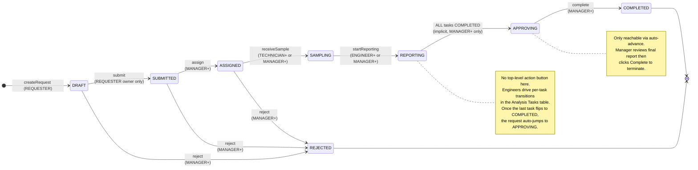
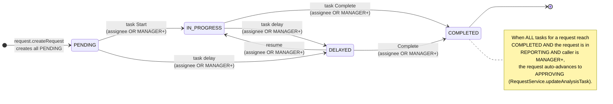
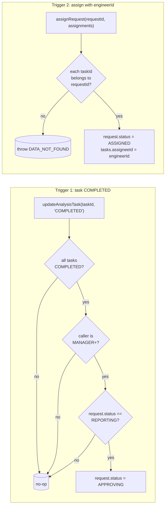
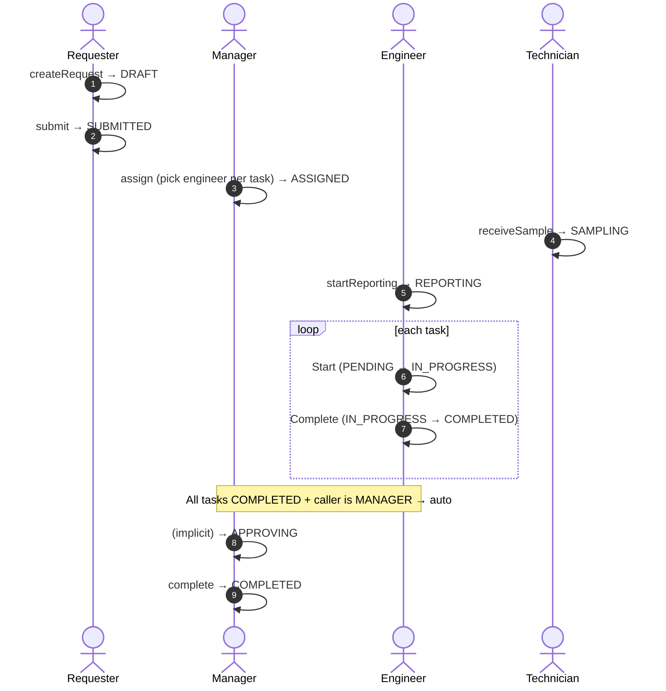
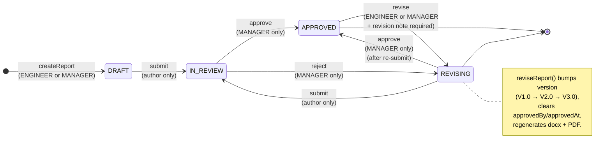
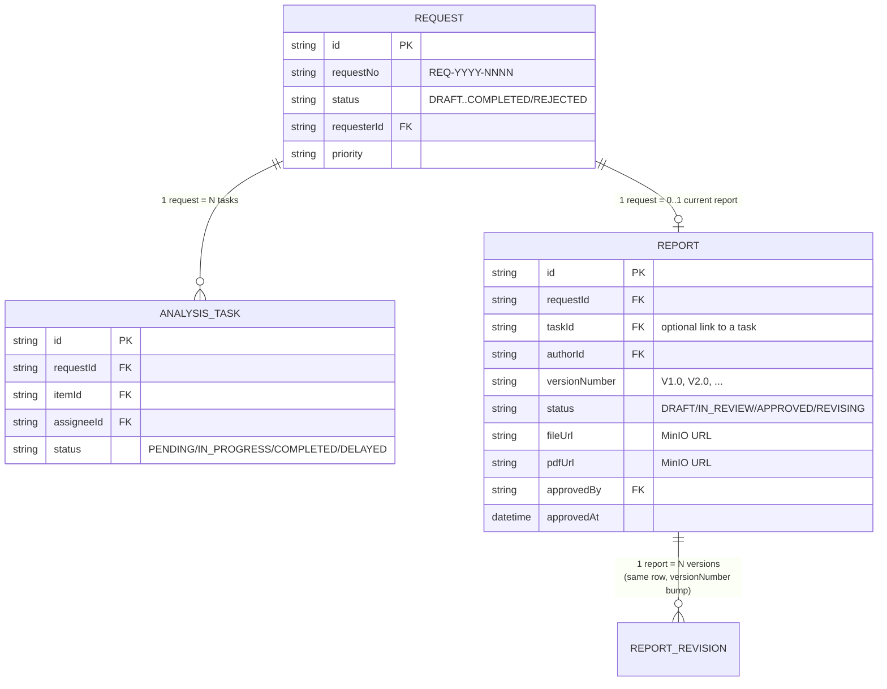
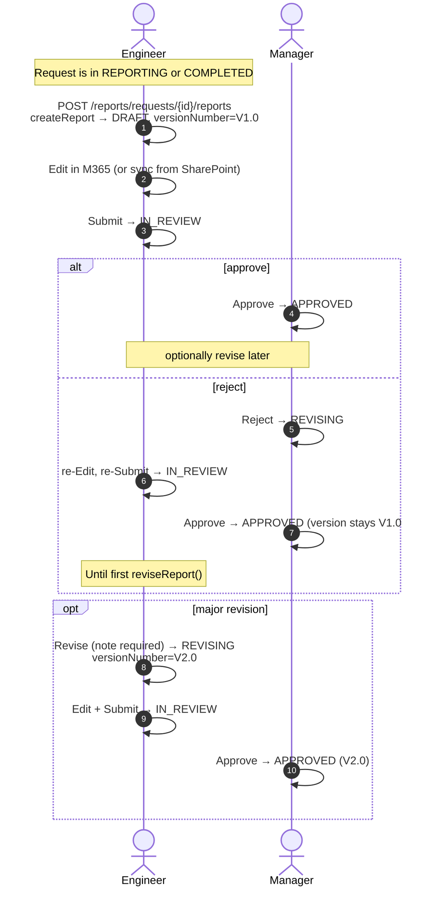

# Request State Machine — Role-Based

Source of truth:
- Backend: [RequestService.java](../../lims-service/src/main/java/com/lims/service/RequestService.java)
- Frontend gates: [RequestDetail/index.tsx](../../lims-web-ui/src/pages/request/RequestDetail/index.tsx), [access.ts](../../lims-web-ui/src/access.ts)

Roles (defined in `access.ts`, additive — ADMIN gets all):
- `REQUESTER` — can create + submit own requests
- `TECHNICIAN` — receive sample (assigned-only)
- `ENGINEER` — start reporting, mark task complete (assignee-only)
- `MANAGER` — assign, reject, approve, complete, override status
- `ADMIN` — every MANAGER capability + admin endpoints

---

## 1. Request lifecycle

### Top-bar action buttons (per state × role)

| State | MANAGER+ | TECHNICIAN+ | ENGINEER+ | REQUESTER |
|-------|----------|-------------|-----------|-----------|
| DRAFT | Submit | — | — | Submit (owner) |
| SUBMITTED | Assign · Reject | — | — | — |
| ASSIGNED | Reject | Receive Sample | — | — |
| SAMPLING | (per-task) | — | Start Reporting | — |
| REPORTING | (no top button) | (per-task) | (per-task) | — |
| APPROVING | Complete | — | — | — |
| COMPLETED / REJECTED | (terminal) | — | — | — |

Notes:
- "Submit" on DRAFT requires the requester to be the owner (`request.getRequesterId() == currentUserId`), enforced by `submitRequest()`.
- "Assign" lets the manager pick one engineer per task; the backend (`assignRequest`) validates each `taskId` belongs to this request (issue #36).
- "Reject" is allowed from DRAFT / SUBMITTED / ASSIGNED (not from SAMPLING / REPORTING / APPROVING — those need a different flow).

---

## 2. Analysis Task lifecycle (independent)

Each request has N analysis tasks (one per selected Analysis Item). Tasks have their own state and are owned by an `assigneeId`.

### Per-task action buttons

| Task state | Engineer (assignee) | MANAGER+ | Other |
|------------|---------------------|----------|-------|
| PENDING | Start | Start | — |
| IN_PROGRESS | Complete | Complete | — |
| DELAYED | (resume via API) | Complete | — |
| COMPLETED | — | — | — |

Ownership check (issue #15): a non-MANAGER caller can only mutate a task where `task.assigneeId == currentUserId`. Otherwise the backend throws `ACCESS_DENIED` even if the UI mistakenly exposed the button.

---

## 3. Implicit (auto) transitions

There are exactly **two** implicit transitions. Both are MANAGER-gated.

Why MANAGER-only? Issue #20: previously any user marking their task COMPLETED could flip the request into APPROVING — silently bypassing the manager-review step in the BPMN flow. Now only `callerCanAdvance` (= ADMIN || MANAGER) triggers the auto-advance. Engineers who finish their work simply leave the request in REPORTING until a manager signs off.

---

## 4. End-to-end happy path

---

## 5. Quick role × action matrix (who can do what)

| Action | Endpoint | REQUESTER | TECHNICIAN | ENGINEER | MANAGER | ADMIN |
|--------|----------|-----------|------------|----------|---------|-------|
| createRequest | POST /requests | ✓ | ✓ | ✓ | ✓ | ✓ |
| submit (own) | POST /requests/{id}/submit | ✓ (owner) | — | — | ✓ | ✓ |
| assign | POST /requests/{id}/assign | — | — | — | ✓ | ✓ |
| reject (DRAFT/SUBMITTED/ASSIGNED) | POST /requests/{id}/reject | — | — | — | ✓ | ✓ |
| receiveSample | POST /requests/{id}/receive-sample | — | ✓ | — | ✓ | ✓ |
| startReporting | POST /requests/{id}/start-reporting | — | — | ✓ | ✓ | ✓ |
| task Start/Complete (own task) | PUT /tasks/{id} | — | — | ✓ (assignee) | ✓ | ✓ |
| task Start/Complete (any task) | PUT /tasks/{id} | — | — | — | ✓ | ✓ |
| auto REPORTING→APPROVING | (in updateAnalysisTask) | — | — | — | ✓ | ✓ |
| complete | POST /requests/{id}/complete | — | — | — | ✓ | ✓ |

Backend always enforces these regardless of UI gating (denyAllByDefault + `@PreAuthorize` on every read endpoint since issue #5/#16).

---

## Part II — Report Workflow

Source of truth:
- Backend: [ReportService.java](../../lims-service/src/main/java/com/lims/service/ReportService.java), [ReportController.java](../../lims-web/src/main/java/com/lims/web/controller/ReportController.java)
- Enum: [ReportStatus.java](../../lims-model/src/main/java/com/lims/model/enums/ReportStatus.java)
- Frontend: [ReportDetail/index.tsx](../../lims-web-ui/src/pages/report/ReportDetail/index.tsx)

## 6. Report lifecycle (independent state machine)

### Top-bar action buttons (Report per state × role)

| State | MANAGER | ENGINEER | Other roles |
|-------|---------|----------|-------------|
| DRAFT | Edit · Sync · Submit | Edit · Sync · Submit | — |
| IN_REVIEW | Approve · Reject | — | — |
| APPROVED | Revise | Revise | — |
| REVISING | Edit · Sync · Submit | Edit · Sync · Submit | — |

Ownership check: `submitReport()` calls `validateReportOwnership()` — only `report.authorId == currentUserId` may submit. Backend rejects otherwise (throws `ACCESS_DENIED`).

## 7. Request ↔ Report association

Key invariants (from code):
1. **Report.requestId** references a Request — created by `POST /api/v1/reports/requests/{requestId}/reports`
2. **Report.versionNumber** is monotonically increasing per report (Major+1, Minor reset to 0); `reviseReport()` increments
3. **Report.approvedBy/approvedAt** cleared on `reviseReport()`; set on `approveReport()`
4. **Report.taskId** is in the schema (nullable) but currently unused by the workflow — reports are tied to the *request*, not a specific task
5. **No FK at DB level** between `report.requestId` and `request.id` (issue #8 noted FKs removed to allow migration order flexibility)

## 8. Report happy path (sequence)

## 9. Report role × action matrix (backend enforcement)

| Action | Endpoint | ENGINEER | MANAGER | ADMIN | Notes |
|--------|----------|----------|---------|-------|-------|
| list reports | GET /reports | ✓ (authenticated) | ✓ | ✓ | |
| get report | GET /reports/{id} | ✓ | ✓ | ✓ | |
| create report | POST /reports/requests/{rid}/reports | ✓ | ✓ | ✓ | `hasAnyRole('ENGINEER','MANAGER')` per `@PreAuthorize` (note: ADMIN not explicitly listed — see problem #2) |
| edit-url (M365) | GET /reports/{id}/edit-url | ✓ | ✓ | ✓ | |
| sync from SP | POST /reports/{id}/sync | ✓ | ✓ | ✓ | |
| submit | POST /reports/{id}/submit | ✓ (author only) | ✓ | ✓ | backend checks `report.authorId == userId` |
| approve | POST /reports/{id}/approve | ✗ | ✓ | ✓ | `hasRole('MANAGER')` — ADMIN not listed (see problem #2) |
| reject | POST /reports/{id}/reject | ✗ | ✓ | ✓ | same |
| revise | POST /reports/{id}/revise | ✓ | ✓ | ✓ | backend requires `revisionNote` non-blank |
| revisions | GET /reports/{id}/revisions | ✓ | ✓ | ✓ | see problem #4 — backend filters by id not requestId |

---

## Part III — Cross-cutting invariants

These are conditions that must hold across Request + Report + Task for the system to be consistent.

| # | Invariant | Where enforced | Status |
|---|-----------|----------------|--------|
| C1 | A requester can only `submit` their own DRAFT request | `RequestService.submitRequest` checks `requesterId == currentUserId` | ✓ |
| C2 | An engineer can only mutate their assigned task | `RequestService.updateAnalysisTask` checks `assigneeId == currentUserId` unless MANAGER+ (issue #15) | ✓ |
| C3 | All tasks COMPLETED + REPORTING + MANAGER+ → request auto-advances to APPROVING | `RequestService.updateAnalysisTask` lines 303-326 (issue #20) | ✓ |
| C4 | `assignRequest` validates every taskId belongs to the requestId | `RequestService.assignRequest` lines 144-153 (issue #36) | ✓ |
| C5 | A report author can only submit their own report | `ReportService.validateReportOwnership` (line 202-207) | ✓ |
| C6 | `reviseReport` requires non-blank revision note | `ReportService.reviseReport` line 151-153 | ✓ |
| C7 | Only MANAGER+ may approve/reject a report | `ReportController` `@PreAuthorize("hasRole('MANAGER')")` (line 76, 85) | ⚠ ADMIN not in role list (problem #2) |
| C8 | Backend denies by default; `@PreAuthorize` on every controller endpoint | `SecurityConfig.prodFilterChain` (issue #5) | ✓ |
