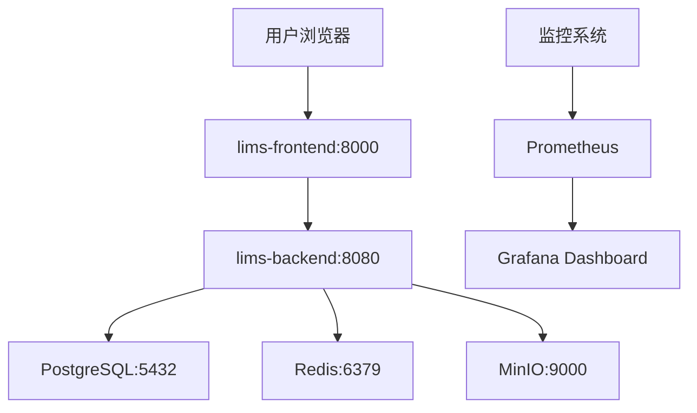

# Material LIMS 部署运维手册

适用版本：1.0.0（Phase 5 收尾）。

## 一、系统架构概览

Material-LIMS 是一个基于 Spring Boot + React 的实验室信息管理系统，采用微服务架构：



## 二、依赖服务

| 服务 | 版本 | 必需 | 用途 | 健康检查 |
|------|------|------|------|----------|
| PostgreSQL | 15+ | 必需 | 主数据库 | `pg_isready -U lims` |
| Redis | 7+ | 推荐 | 缓存（i18n / 节假日 / 基础数据） | `redis-cli ping` |
| MinIO | RELEASE.2024+ | 推荐 | 报告文件 / 知识库附件存储 | HTTP 200 |
| LibreOffice | 7.x | 可选 | Word→PDF 转换 | - |
| Azure AD | - | 生产必需 | SSO / OAuth2 登录 | - |

## 三、Docker Compose 一键部署

### 3.1 环境准备

```bash
# 1. 克隆代码库
git clone https://github.com/your-org/material-lims.git
cd material-lims

# 2. 安装依赖工具
# Docker & Docker Compose (v2.0+)
# Java 17 (用于本地开发)
# Node.js 18+ (用于前端构建)

# 3. 检查系统资源
# 推荐配置：4核CPU，8GB内存，50GB磁盘空间
```

### 3.2 配置环境变量

```bash
# 复制环境变量模板
cp .env.example .env

# 编辑 .env 文件，配置生产环境参数
# 必须修改的安全配置：
POSTGRES_PASSWORD=your_secure_password_here
SECURITY_JWT_SECRET=your_32_bytes_random_jwt_secret_here
MINIO_ROOT_PASSWORD=your_minio_admin_password
```

### 3.3 构建和启动

```bash
# 1. 构建前端静态文件
cd lims-web-ui
npm install
npm run build
cd ..

# 2. 启动所有服务
docker compose up -d --build

# 3. 等待服务启动（约2-3分钟）
docker compose logs -f lims-backend

# 4. 健康检查
curl http://localhost:8080/actuator/health
# 预期输出：{"status":"UP"}

# 5. 访问应用
# 前端：http://localhost:8000
# 后端API：http://localhost:8080
# MinIO控制台：http://localhost:9001 (admin/admin)
```

### 3.4 数据库初始化

系统首次启动时会自动执行Flyway数据库迁移：

```sql
-- 检查数据库状态
docker compose exec postgres psql -U lims -d lims -c "SELECT version(), current_timestamp;"

-- 查看Flyway迁移历史
docker compose exec lims-backend java -jar app.jar --spring.profiles.active=prod flyway.info
```

## 四、生产环境配置

### 4.1 安全配置

```bash
# .env 生产环境配置示例
SPRING_PROFILES_ACTIVE=prod

# JWT密钥（必须32字节以上）
SECURITY_JWT_SECRET=$(openssl rand -base64 32)

# 数据库密码
POSTGRES_PASSWORD=$(openssl rand -base64 16)

# Redis密码（可选但推荐）
REDIS_PASSWORD=$(openssl rand -base64 16)

# MinIO访问密钥
MINIO_ROOT_PASSWORD=$(openssl rand -base64 16)
MINIO_ACCESS_KEY=lims_prod_access
MINIO_SECRET_KEY=$(openssl rand -base64 32)
```

### 4.2 性能优化配置

```yaml
# 在 application-prod.yml 中添加
spring:
  datasource:
    hikari:
      maximum-pool-size: 20
      minimum-idle: 5
      connection-timeout: 30000
      idle-timeout: 600000
      max-lifetime: 1800000
  redis:
    lettuce:
      pool:
        max-active: 20
        max-idle: 10
        min-idle: 5
```

### 4.3 必备环境变量清单

后端（`lims-backend`）：

| 变量 | 默认值 | 生产环境要求 |
|------|--------|-------------|
| `SPRING_PROFILES_ACTIVE` | dev | **必须改为 prod** |
| `POSTGRES_PASSWORD` | lims_dev_password | **强密码** |
| `SECURITY_JWT_SECRET` | dev-secret | **32字节随机密钥** |
| `MINIO_ROOT_PASSWORD` | minioadmin | **强密码** |
| `REDIS_PASSWORD` | 空 | 推荐设置密码 |
| `AZURE_AD_*` | 空 | 生产环境必需 |

## 五、监控与日志

### 5.1 Spring Boot Actuator

系统内置监控端点：

- `/actuator/health` - 健康检查
- `/actuator/metrics` - 应用指标
- `/actuator/prometheus` - Prometheus格式指标
- `/actuator/info` - 应用信息
- `/actuator/env` - 环境变量

### 5.2 关键监控指标

```yaml
# Prometheus采集配置示例
scrape_configs:
  - job_name: 'lims-backend'
    metrics_path: '/actuator/prometheus'
    static_configs:
      - targets: ['lims-backend:8080']
    scrape_interval: 30s
```

**关键告警指标：**
- HTTP错误率 > 1%
- 数据库连接池使用率 > 80%
- JVM内存使用率 > 85%
- 响应时间 P95 > 2秒

### 5.3 日志配置

```yaml
# logback-spring.xml 生产配置
logging:
  level:
    com.lims: INFO
    org.springframework.security: WARN
  file:
    path: /var/log/lims
    name: /var/log/lims/application.log
  pattern:
    file: "%d{yyyy-MM-dd HH:mm:ss} [%thread] %-5level %logger{36} - %msg%n"
```

## 六、备份与恢复

### 6.1 数据库备份

```bash
#!/bin/bash
# backup-database.sh

BACKUP_DIR="/backup/lims"
DATE=$(date +%Y%m%d_%H%M%S)

# 创建备份目录
mkdir -p $BACKUP_DIR

# 数据库备份
docker compose exec postgres pg_dump -U lims -F c lims > $BACKUP_DIR/lims_$DATE.dump

# 备份MinIO数据
docker compose exec minio mc mirror --overwrite /data $BACKUP_DIR/minio_$DATE/

# 清理30天前的备份
find $BACKUP_DIR -name "*.dump" -mtime +30 -delete
find $BACKUP_DIR -name "minio_*" -type d -mtime +30 -exec rm -rf {} +

echo "备份完成: $BACKUP_DIR/lims_$DATE.dump"
```

### 6.2 恢复流程

```bash
# 停止应用
docker compose down

# 恢复数据库
docker compose exec -T postgres pg_restore -U lims -d lims --clean --if-exists < backup/lims_20240624.dump

# 恢复MinIO数据
docker compose exec minio mc mirror --overwrite backup/minio_20240624/ /data

# 重启服务
docker compose up -d
```

## 七、高可用部署

### 7.1 Docker Swarm 部署

```yaml
# docker-stack.yml
version: '3.8'
services:
  lims-backend:
    image: your-registry/lims-backend:latest
    deploy:
      replicas: 2
      restart_policy:
        condition: on-failure
      resources:
        limits:
          memory: 2G
        reservations:
          memory: 1G
    
  postgres:
    image: postgres:15
    deploy:
      placement:
        constraints: [node.role == manager]
```

### 7.2 Kubernetes 部署

```yaml
# k8s-deployment.yaml
apiVersion: apps/v1
kind: Deployment
metadata:
  name: lims-backend
spec:
  replicas: 2
  selector:
    matchLabels:
      app: lims-backend
  template:
    metadata:
      labels:
        app: lims-backend
    spec:
      containers:
      - name: lims-backend
        image: your-registry/lims-backend:latest
        ports:
        - containerPort: 8080
        envFrom:
        - secretRef:
            name: lims-secrets
        livenessProbe:
          httpGet:
            path: /actuator/health
            port: 8080
          initialDelaySeconds: 60
          periodSeconds: 30
```

## 八、故障排查

### 8.1 常见问题

**问题1：应用启动失败**
```bash
# 查看详细日志
docker compose logs lims-backend

# 检查数据库连接
docker compose exec postgres psql -U lims -d lims -c "SELECT 1;"
```

**问题2：前端无法访问后端API**
```bash
# 检查网络连通性
docker compose exec lims-frontend curl http://lims-backend:8080/actuator/health

# 检查nginx配置
docker compose exec lims-frontend cat /etc/nginx/conf.d/default.conf
```

**问题3：数据库性能问题**
```sql
-- 查看慢查询
SELECT query, calls, total_time, mean_time 
FROM pg_stat_statements 
ORDER BY mean_time DESC 
LIMIT 10;
```

### 8.2 性能优化建议

1. **数据库索引优化**：为常用查询字段添加索引
2. **缓存策略**：合理使用Redis缓存热点数据
3. **连接池调优**：根据并发量调整HikariCP配置
4. **JVM调优**：设置合适的堆内存大小

## 九、升级流程

### 9.1 版本升级

```bash
# 1. 备份当前数据
./scripts/backup-database.sh

# 2. 拉取最新代码
git pull origin main

# 3. 构建新版本
docker compose build --no-cache

# 4. 滚动更新
docker compose up -d

# 5. 验证升级
curl http://localhost:8080/actuator/info
```

### 9.2 数据库迁移

系统使用Flyway管理数据库版本，升级时会自动执行迁移脚本：

```bash
# 查看迁移状态
docker compose exec lims-backend java -jar app.jar flyway.info

# 手动执行迁移（如果需要）
docker compose exec lims-backend java -jar app.jar flyway.migrate
```

## 十、安全审计

### 10.1 定期安全检查

- [ ] 更新依赖库安全补丁
- [ ] 审查访问日志中的异常请求
- [ ] 检查数据库权限配置
- [ ] 验证SSL/TLS证书有效期
- [ ] 审计用户权限分配

### 10.2 安全配置清单

- [ ] 使用强密码和随机密钥
- [ ] 启用HTTPS加密传输
- [ ] 配置防火墙规则
- [ ] 定期备份关键数据
- [ ] 监控异常登录行为

---

**技术支持**：如遇部署问题，请查看日志文件或联系运维团队。