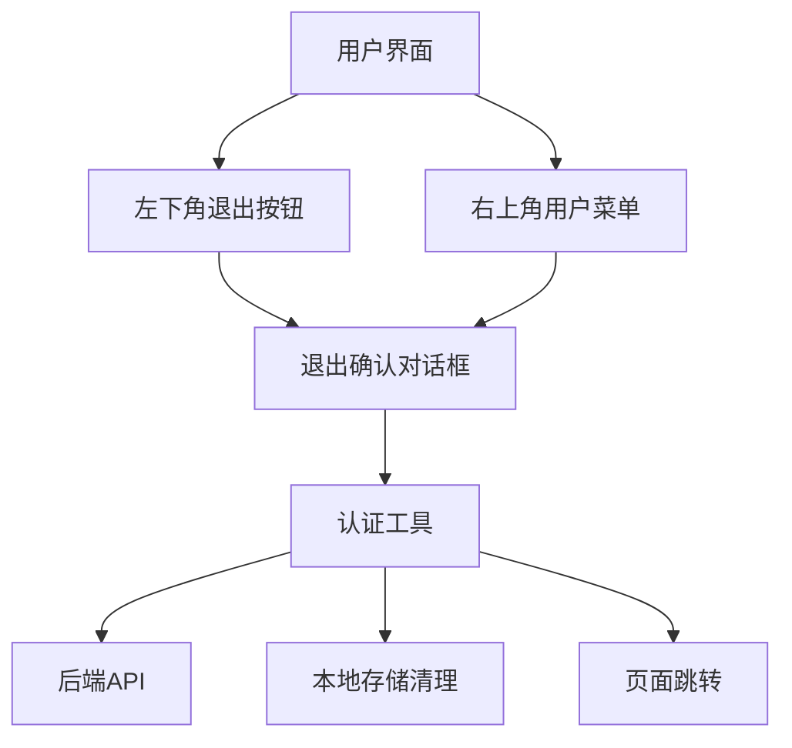
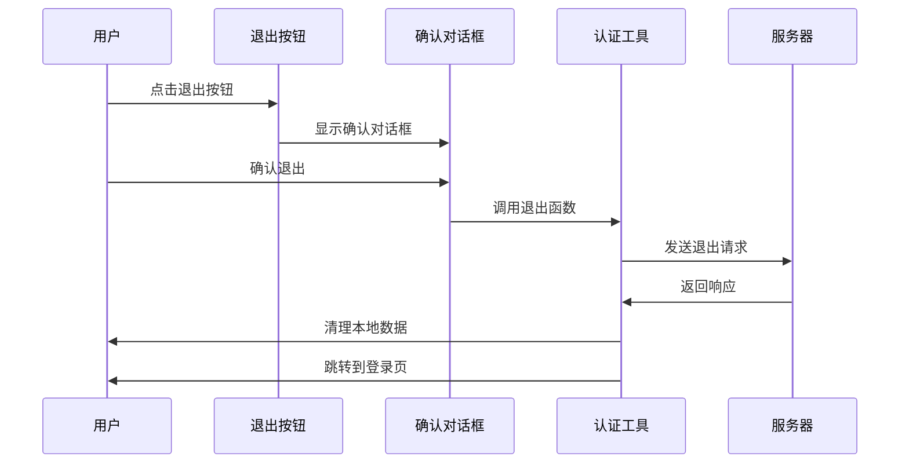

# 左下角退出功能指南

> 📍 Material LIMS 用户界面增强功能  
> 🚀 版本: v1.0.0 | 📅 最后更新: 2024年12月

## 📋 功能概述

左下角退出功能是 Material LIMS 项目的用户体验增强特性，提供了一个直观、便捷的退出操作入口，同时保持了原有的右上角用户菜单功能。

### 🎯 设计目标

- **增强用户体验**: 提供更直观的退出操作入口
- **保持一致性**: 与 Material Design 设计语言保持一致
- **功能完整性**: 支持多种退出方式和错误处理
- **可访问性**: 支持键盘导航和屏幕阅读器

### 🏗️ 架构设计



## 🚀 快速开始

### 基本使用

左下角退出按钮会自动显示在除登录页面外的所有页面中：

1. **位置**: 界面左下角，固定定位
2. **样式**: Material Design 风格，悬浮效果
3. **交互**: 点击后显示确认对话框
4. **功能**: 安全退出系统并跳转到登录页

### 退出流程



## 🔧 配置选项

### 布局配置

在 `lims-web-ui/config/config.ts` 中配置布局：

```typescript
// 使用自定义布局（包含左下角退出按钮）
export default defineConfig({
  layout: {
    name: 'Material LIMS',
    logo: 'https://gw.alipayobjects.com/zos/rmsportal/KDpgvguMpGfqaHPjicRK.svg',
    layout: 'mix',
  },
});
```

### 样式定制

退出按钮的样式可以通过 CSS 变量进行定制：

```css
/* 在全局样式文件中定义 */
:root {
  --logout-button-bg-color: #1976d2;
  --logout-button-hover-bg: #1565c0;
  --logout-button-shadow: 0 2px 8px rgba(25, 118, 210, 0.3);
}
```

## 🎨 组件说明

### 1. 退出按钮组件 (`LogoutButton`)

**位置**: `src/components/LogoutButton/`

**功能**: 基础退出按钮，支持浮动定位和响应式设计

**属性**:
- `floating`: boolean - 是否启用浮动定位
- `size`: 'small' | 'middle' | 'large' - 按钮尺寸
- `onLogout`: () => void - 点击回调函数

### 2. 确认对话框组件 (`LogoutConfirmModal`)

**位置**: `src/components/LogoutConfirmModal/`

**功能**: 退出确认对话框，显示当前用户信息

**属性**:
- `visible`: boolean - 是否显示对话框
- `onCancel`: () => void - 取消回调
- `onConfirm`: () => void - 确认回调
- `currentUser`: object - 当前用户信息
- `loading`: boolean - 加载状态

### 3. 增强退出按钮 (`EnhancedLogoutButton`)

**位置**: `src/components/EnhancedLogoutButton/`

**功能**: 集成退出按钮和确认对话框的完整解决方案

### 4. 自定义布局 (`CustomLayout`)

**位置**: `src/layouts/CustomLayout/`

**功能**: 包装应用布局，集成左下角退出功能

## 🔌 API 接口

### 认证工具 (`src/utils/auth.ts`)

#### `logout()` - 标准退出

执行完整的退出流程：
1. 发送退出请求到服务器
2. 清理本地存储数据
3. 跳转到登录页面

```typescript
import { logout } from '@/utils/auth';

// 基本使用
await logout();

// 错误处理
try {
  await logout();
} catch (error) {
  console.error('退出失败:', error);
}
```

#### `silentLogout()` - 静默退出

仅清理本地数据，不跳转页面：

```typescript
import { silentLogout } from '@/utils/auth';

// 静默退出
await silentLogout();
```

#### `forceLogout()` - 强制退出

忽略所有错误，立即跳转：

```typescript
import { forceLogout } from '@/utils/auth';

// 强制退出
forceLogout();
```

#### `isLogoutInProgress()` - 检查退出状态

检查是否正在执行退出操作：

```typescript
import { isLogoutInProgress } from '@/utils/auth';

if (isLogoutInProgress()) {
  console.log('退出操作正在进行中');
}
```

## 🧪 测试指南

### 单元测试

运行退出功能的单元测试：

```bash
# 运行所有退出功能测试
npm test -- --testPathPattern="logout|auth"

# 运行特定组件测试
npm test -- src/components/EnhancedLogoutButton/__tests__/index.test.tsx
npm test -- src/utils/__tests__/auth.test.ts
npm test -- src/layouts/CustomLayout/__tests__/index.test.tsx
```

### 测试覆盖率

```bash
# 生成测试覆盖率报告
npm test -- --coverage --testPathPattern="logout|auth"
```

## 🐛 故障排除

### 常见问题

#### 1. 退出按钮不显示

**可能原因**:
- 当前页面是登录页面
- 布局配置未正确应用
- CSS 样式冲突

**解决方案**:
```typescript
// 检查当前路由
import { useLocation } from '@umijs/max';

const location = useLocation();
console.log('当前路径:', location.pathname);

// 验证布局配置
// 检查 config/config.ts 中的 layout 配置
```

#### 2. 退出后页面未跳转

**可能原因**:
- 退出请求失败
- 本地存储清理异常
- 浏览器重定向问题

**解决方案**:
```typescript
// 使用强制退出
import { forceLogout } from '@/utils/auth';
forceLogout();

// 检查网络连接和服务器状态
```

#### 3. 退出确认对话框不显示

**可能原因**:
- 组件状态管理问题
- 事件绑定错误
- React 渲染问题

**解决方案**:
```typescript
// 检查组件状态
console.log('对话框可见性:', visible);

// 验证事件绑定
<LogoutButton onLogout={handleLogoutClick} />
```

### 调试技巧

#### 启用详细日志

```typescript
// 在开发环境中启用调试日志
localStorage.setItem('debug', 'logout:*');

// 查看退出流程日志
console.log('退出流程开始...');
```

#### 网络请求监控

使用浏览器开发者工具监控退出请求：

1. 打开 Network 标签页
2. 过滤 `/api/v1/auth/logout` 请求
3. 检查请求状态和响应

## 🔄 更新日志

### v1.0.0 (2024-12-24)
- ✅ 初始版本发布
- ✅ 左下角退出按钮组件
- ✅ 退出确认对话框
- ✅ 增强认证工具
- ✅ 自定义布局集成
- ✅ 完整单元测试覆盖
- ✅ 响应式设计支持

## 🤝 贡献指南

### 添加新功能

1. **遵循现有模式**: 参考现有组件结构和命名约定
2. **添加单元测试**: 确保新功能有完整的测试覆盖
3. **更新文档**: 在本文档中添加相应的说明

### 报告问题

发现问题时请提供：
- 浏览器版本和操作系统
- 错误信息和堆栈跟踪
- 复现步骤
- 相关截图或录屏

## 📞 支持与反馈

如有问题或建议，请联系：
- **项目维护者**: 开发团队
- **问题报告**: GitHub Issues
- **功能请求**: Feature Requests

---

*🎯 持续改进用户体验，从每一次退出开始！*