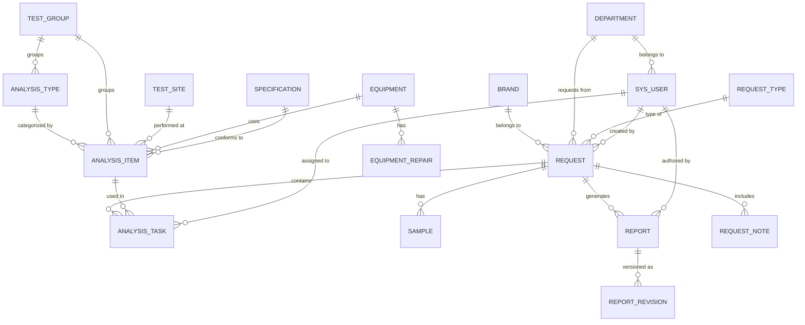

# Material LIMS 详细设计方案计划

> 基于已批准的项目简报（2026-06-04-material-lims-brief.md），本计划定义完整的技术方案文档结构、各章节核心内容、数据模型和实现细节。

---

## 方案文档总体结构

```
1. 系统架构设计
2. 数据库详细设计（ER图 + DDL）
3. API 接口设计
4. 前端页面与路由设计
5. 工作流详细设计（BPMN）
6. 外部集成详细设计
7. Word在线编辑集成方案
8. 安全与权限设计
9. 部署架构设计
10. 开发规范与约定
```

---

## Section 1: 系统架构设计

**目标**：定义系统整体分层架构、模块划分、技术栈版本锁定和依赖关系。

**核心内容**：

### 1.1 整体分层架构

```
┌──────────────────────────────────────────────────────────────┐
│                        前端层 (React SPA)                      │
│  Ant Design Pro / ProLayout / ProTable / Umi.js / ECharts    │
└──────────────────────┬───────────────────────────────────────┘
                       │ HTTPS / REST API
┌──────────────────────▼───────────────────────────────────────┐
│                     网关层 (Spring Cloud Gateway)              │
│              路由 / 鉴权 / 限流 / 日志                         │
└──────────────────────┬───────────────────────────────────────┘
                       │
┌──────────────────────▼───────────────────────────────────────┐
│                    应用服务层 (Spring Boot 3.x)                │
│  ┌──────────┐ ┌──────────┐ ┌──────────┐ ┌───────────────┐   │
│  │基础数据   │ │委托流程   │ │报告管理   │ │设备管理       │   │
│  │Service   │ │Service   │ │Service   │ │Service       │   │
│  └──────────┘ └──────────┘ └──────────┘ └───────────────┘   │
│  ┌──────────┐ ┌──────────┐ ┌──────────┐ ┌───────────────┐   │
│  │集成服务   │ │仪表盘    │ │权限服务   │ │通知服务       │   │
│  │Service   │ │Service   │ │Service   │ │Service       │   │
│  └──────────┘ └──────────┘ └──────────┘ └───────────────┘   │
│                                                               │
│  Flowable Engine ── Spring Security ── i18n                  │
└───────────┬──────────┬──────────┬──────────┬────────────────┘
            │          │          │          │
     ┌──────▼──┐ ┌────▼────┐ ┌──▼───┐ ┌───▼────┐
     │PostgreSQL│ │ Redis   │ │MinIO │ │LibreOffice│
     │  15+    │ │ 7.x    │ │      │ │Headless  │
     └─────────┘ └────────┘ └──────┘ └──────────┘
```

### 1.2 模块依赖关系

- 基础数据模块：无依赖，最先开发
- 委托流程模块：依赖基础数据 + Flowable + 权限
- 报告管理模块：依赖委托流程 + M365集成
- 设备管理模块：依赖基础数据，相对独立
- 集成服务模块：依赖认证配置，可并行开发
- 仪表盘模块：依赖委托流程 + 设备管理数据

### 1.3 技术栈版本锁定

| 组件 | 版本 | 说明 |
|------|------|------|
| Java | 17 LTS | 长期支持版 |
| Spring Boot | 3.2.x | 最新稳定版 |
| Flowable | 7.0.x | Spring Boot 3 兼容版 |
| React | 18.x | 稳定版 |
| Ant Design | 5.x | 最新版 |
| Ant Design Pro | 6.x | 企业级模板 |
| Umi.js | 4.x | React 企业级框架 |
| PostgreSQL | 15.x | 稳定版 |
| Redis | 7.x | 稳定版 |
| MinIO | latest | 对象存储 |
| Node.js | 20 LTS | 前端构建 |

**预估字数**：800-1000字

---

## Section 2: 数据库详细设计

**目标**：定义完整的 ER 图和所有表的 DDL，覆盖全部21个需求条目。

**核心内容**：

### 2.1 ER 图（Mermaid）



### 2.2 核心表设计

**基础数据表**（6张）：

- `brand` — id, name, description, created_at, updated_at
- `request_type` — id, name, part_info_required, task_duration_days, description, created_at, updated_at
- `holiday` — id, date, name, type(NATIONAL/COMPANY), year, created_at
- `request_note` — id, content, is_active, sort_order, created_at, updated_at
- `department` — id, name, parent_id, external_id, level, sort_order, created_at, updated_at
- `knowledge_doc` — id, title, category(MANUAL/VIDEO), file_url, description, created_at, updated_at

**测试数据表**（5张）：

- `test_group` — id, name, description, created_at, updated_at
- `test_site` — id, name, location, description, created_at, updated_at
- `analysis_type` — id, group_id(FK), name, description, created_at, updated_at
- `analysis_item` — id, group_id(FK), site_id(FK), type_id(FK), name, equipment_id(FK), test_standards, cost, unit_price, unit, description, attachment_url, created_at, updated_at
- `specification` — id, group_id(FK), name, unit, description, created_at, updated_at

**核心业务表**（5张）：

- `request` — id, request_no, brand_id(FK), dept_id(FK), type_id(FK), requester_id(FK), proxy_requester_id(FK nullable), part_number, part_name, eco, supplier_code, supplier_name, request_reason, priority(LOW/NORMAL/HIGH/URGENT), status(DRAFT/SUBMITTED/ASSIGNED/SAMPLING/REPORTING/APPROVING/COMPLETED/REJECTED), due_date, sample_delivery_note, total_cost, created_at, updated_at
- `analysis_task` — id, request_id(FK), item_id(FK), assignee_id(FK), status(PENDING/IN_PROGRESS/DELAYED/COMPLETED), delay_reason, started_at, completed_at, created_at, updated_at
- `sample` — id, request_id(FK), received_by(FK), received_at, preparation_status(PENDING/PREPARING/READY), preparation_detail, created_at, updated_at
- `report` — id, request_id(FK), task_id(FK), author_id(FK), version, revision_note, status(DRAFT/IN_REVIEW/APPROVED/REVISING), file_url, pdf_url, sharepoint_file_id, created_at, updated_at
- `report_revision` — id, report_id(FK), version, revision_note, file_url, pdf_url, archived_at, created_at

**设备管理表**（2张）：

- `equipment` — id, name, model, serial_number, status(ACTIVE/UNDER_REPAIR/DECOMMISSIONED), location, purchase_date, warranty_expiry, description, created_at, updated_at
- `equipment_repair` — id, equipment_id(FK), report_date, fault_description, repair_action, repair_cost, repaired_by, completion_date, status(REPORTING/REPAIRING/COMPLETED), created_at, updated_at

**系统表**（3张）：

- `sys_user` — id, email, display_name, login_id, dept_id(FK), roles, external_id, is_active, created_at, updated_at
- `sys_operation_log` — id, user_id, module, action, detail, ip, created_at
- `sys_i18n_message` — id, message_key, locale(zh/en), message_value

**通用设计约定**：
- 所有表使用 UUID 主键
- 审计字段：created_at, updated_at, created_by, updated_by
- 逻辑删除：deleted_at (nullable)
- 乐观锁：version 字段

**预估字数**：2000-2500字（含DDL）

---

## Section 3: API 接口设计

**目标**：定义 RESTful API 规范和所有接口清单，按模块分组。

**核心内容**：

### 3.1 API 规范

- 基础路径：`/api/v1/`
- 认证：Bearer Token (JWT)
- 分页：`?page=0&size=20&sort=createdAt,desc`
- 响应格式：`{ code: 200, message: "success", data: {}, timestamp: "..." }`
- 错误码：4位数字（1xxx 通用 / 2xxx 业务 / 3xxx 权限 / 5xxx 系统）
- i18n：通过 `Accept-Language: zh/en` 切换

### 3.2 接口清单

**认证模块**：
- POST `/api/v1/auth/login` — SSO 登录回调
- POST `/api/v1/auth/logout` — 登出
- GET `/api/v1/auth/me` — 当前用户信息

**基础数据 CRUD**（6组，每组标准CRUD）：
- `/api/v1/brands` — GET/POST/PUT/DELETE
- `/api/v1/request-types` — GET/POST/PUT/DELETE
- `/api/v1/holidays` — GET/POST/PUT/DELETE + POST `/import` 批量导入
- `/api/v1/request-notes` — GET/POST/PUT/DELETE
- `/api/v1/departments` — GET/POST/PUT/DELETE + GET `/tree` 树形结构
- `/api/v1/knowledge-docs` — GET/POST/PUT/DELETE

**测试数据 CRUD**（5组）：
- `/api/v1/test-groups`
- `/api/v1/test-sites`
- `/api/v1/analysis-types`
- `/api/v1/analysis-items`
- `/api/v1/specifications`

**委托流程**：
- POST `/api/v1/requests` — 创建委托
- GET `/api/v1/requests` — 列表（支持筛选/分页）
- GET `/api/v1/requests/{id}` — 详情
- PUT `/api/v1/requests/{id}` — 更新
- POST `/api/v1/requests/{id}/submit` — 提交
- POST `/api/v1/requests/{id}/assign` — Manager分配
- POST `/api/v1/requests/{id}/reject` — Manager拒绝/退回
- POST `/api/v1/requests/{id}/receive-sample` — Technician接收样品
- POST `/api/v1/requests/{id}/prepare-sample` — 制样完成

**分析任务**：
- GET `/api/v1/requests/{requestId}/tasks` — 委托下的任务列表
- PUT `/api/v1/tasks/{id}` — 更新任务状态
- POST `/api/v1/tasks/{id}/delay` — 标记延期（附原因）

**报告管理**：
- POST `/api/v1/requests/{requestId}/reports` — 创建报告
- GET `/api/v1/reports/{id}` — 报告详情
- GET `/api/v1/reports/{id}/edit-url` — 获取M365在线编辑URL
- POST `/api/v1/reports/{id}/submit` — 提交审批
- POST `/api/v1/reports/{id}/approve` — 审批通过
- POST `/api/v1/reports/{id}/reject` — 审批退回
- GET `/api/v1/reports/{id}/download` — 下载Word
- GET `/api/v1/reports/{id}/download-pdf` — 下载PDF
- POST `/api/v1/reports/{id}/revise` — 发起版本升级
- GET `/api/v1/reports/{id}/revisions` — 版本历史

**仪表盘**：
- GET `/api/v1/dashboard/my-tasks` — 我的工作台
- GET `/api/v1/dashboard/manager-overview` — Manager全局视图
- GET `/api/v1/dashboard/request-stats` — Request统计
- GET `/api/v1/dashboard/cost-stats` — 成本统计
- GET `/api/v1/dashboard/equipment-stats` — 设备统计

**设备管理**：
- `/api/v1/equipments` — CRUD
- `/api/v1/equipment-repairs` — CRUD + GET `/{id}/print` 打印

**外部集成**：
- GET `/api/v1/external/parts` — 零部件查询（代理转发）
- GET `/api/v1/external/suppliers` — 供应商查询（代理转发）
- POST `/api/v1/sync/users` — 手动触发人员同步
- POST `/api/v1/sync/departments` — 手动触发部门同步

**预估字数**：1500-2000字

---

## Section 4: 前端页面与路由设计

**目标**：定义页面结构、路由、布局和核心交互流程。

**核心内容**：

### 4.1 路由结构

```
/                           → 工作台首页（根据角色不同展示不同内容）
/login                      → SSO 登录页
/basic-data                 → 基础数据管理
  /basic-data/brands        → Brand 管理
  /basic-data/request-types → Request Type 管理
  /basic-data/holidays      → Holidays 管理
  /basic-data/request-notes → Request Notes 管理
  /basic-data/departments   → Department 管理
/test-data                  → 测试数据管理
  /test-data/groups         → Test Group 管理
  /test-data/sites          → Test Site 管理
  /test-data/analysis-types → Analysis Type 管理
  /test-data/analysis-items → Analysis Item 管理
  /test-data/specifications → Specification 管理
/request                    → 委托管理
  /request/list             → 委托列表
  /request/create           → 创建委托
  /request/:id              → 委托详情（含流程操作）
  /request/kanban           → Request 看板
/report                     → 报告管理
  /report/list              → 报告列表
  /report/:id               → 报告详情/在线编辑
  /report/:id/revisions     → 版本历史
  /report/archive           → 历史版本归档
/equipment                  → 设备管理
  /equipment/list           → 设备台账
  /equipment/status         → 设备状态仪表盘
  /equipment/repairs        → 维修记录
/dashboard                  → 仪表盘
  /dashboard/cost           → 成本统计
/knowledge                  → 知识库
  /knowledge/docs           → 操作手册/视频
/admin                      → 系统管理
  /admin/users              → 用户管理
  /admin/logs               → 操作日志
  /admin/i18n               → 国际化配置
```

### 4.2 核心页面交互流程

**创建委托页**：
1. 选择 Brand（下拉）→ 自动加载关联的 Request Type
2. 输入 Part Number → 实时查询 API 回填 Part Name / ECO
3. 输入 Supplier → 实时查询 API 回填供应商信息
4. 选择 Analysis Items（多选，按 Test Group → Type → Item 三级联动）
5. 自动计算 Due Date（基于 Request Type 的 task_duration_days，跳过节假日）
6. Request Notes 自动展示
7. 提交 → 流程进入 Manager 分配节点

**Manager 分配页**：
1. 查看委托详情
2. 分配 Engineer（每个 Analysis Task 可分配不同 Engineer）
3. 修正错误信息
4. 标记优先级
5. 关联测试计划（可选）
6. 操作：确认分配 / 退回 / 拒绝

**报告编辑页**：
1. 查看 Request 基本信息
2. 系统自动生成报告模板（已填充基础信息）
3. 点击"在线编辑" → 跳转 M365 Online Word 编辑器
4. 编辑完成后回调 → 更新报告状态
5. 提交审批 / 标记延期

**预估字数**：1200-1500字

---

## Section 5: 工作流详细设计

**目标**：定义 BPMN 流程模型、各节点权限、超时规则和分支逻辑。

**核心内容**：

### 5.1 Request 主流程 BPMN

```
[Start Event]
    │
    ▼
[创建委托] (Requester / 代理)
    │ submit
    ▼
[Manager 分配] (Manager)
    │ assign                    │ reject          │ return
    ▼                           ▼                 ▼
[Technician 样品接收]        [End: Rejected]    [Back to 创建]
    │ receive
    ▼
[Technician 制样]
    │ prepare
    ▼
[Engineer 创建报告] (Engineer)
    │ submit_report              │ delay
    ▼                            ▼
[Manager 审批报告]          [标记延期，记录原因]
    │ approve        │ reject
    ▼                ▼
[End: Completed]   [Back to 创建报告]
```

### 5.2 Revise Report 子流程

```
[已审批通过的 Report]
    │ revise
    ▼
[填写修改原因] (Engineer)
    │
    ▼
[版本号递增，创建新版本报告]
    │
    ▼
[Engineer 编辑新版报告]
    │ submit
    ▼
[Manager 审批新版报告]
    │ approve                 │ reject
    ▼                         ▼
[旧版本归档]               [退回修改]
[更新为最新版]
    │
    ▼
[End]
```

### 5.3 流程变量定义

- `requestStatus`：DRAFT / SUBMITTED / ASSIGNED / SAMPLING / REPORTING / APPROVING / COMPLETED / REJECTED
- `assignee`：当前节点负责人
- `priority`：LOW / NORMAL / HIGH / URGENT
- `dueDate`：自动计算
- `delayReason`：延期原因（延期时必填）

### 5.4 超时与提醒规则

- Due Date 前 3 天：黄色预警通知
- Due Date 前 1 天：橙色预警通知
- Due Date 超期：红色告警 + 邮件通知 Manager
- 通知渠道：系统内消息 + Microsoft Teams 通知（可选）

**预估字数**：1000-1200字

---

## Section 6: 外部集成详细设计

**目标**：定义三个外部系统的集成方案、数据流、异常处理和同步策略。

**核心内容**：

### 6.1 Azure AD / Teams 集成

**认证**：OAuth2.0 Client Credentials Flow（应用权限）

**人员同步流程**：
```
@Scheduled(cron = "0 0 * * * ?")  // 每小时执行
1. 调用 Microsoft Graph API: GET /users?$select=displayName,mail,department,jobTitle,id
2. 对比 sys_user 表：
   - external_id 匹配 → 检测字段变更 → 执行 UPDATE
   - external_id 不存在 → 执行 INSERT
   - sys_user 中有但 Graph 中无 → 标记 is_active = false（不删除）
3. 记录同步日志
```

**部门同步流程**：
```
1. 调用 Graph API: GET /organization + /users?$select=department
2. 解析部门层级关系（通过 department 字段拆分或 API 查询子部门）
3. 对比 department 表：
   - external_id 匹配 → 检测变更 → UPDATE
   - 不存在 → INSERT，维护 parent_id 层级
4. 记录同步日志
```

### 6.2 零部件实时查询

**接口**：后端代理模式，前端不直接调用外部API

```
前端输入 Part Number/Name
    → GET /api/v1/external/parts?keyword=xxx
    → 后端调用主数据系统API（带熔断器）
    → 返回 [{partNumber, partName, eco, ...}]
    → 前端展示下拉，用户选择后回填表单
```

**异常处理**：
- API 不可用：返回空列表 + 提示"主数据系统暂不可用，可手动输入"
- 查询超时（3s）：熔断降级
- 无结果：提示"未找到匹配零件，可手动输入"

### 6.3 供应商实时查询

逻辑同零部件查询，增加模糊匹配支持（按编号/ID/名称搜索）

**预估字数**：1000-1200字

---

## Section 7: Word 在线编辑集成方案

**目标**：详细设计 M365 Online 集成的技术实现路径。

**核心内容**：

### 7.1 方案选择：WOPI 协议 vs iframe 嵌入 vs Graph API 直接操作

| 方案 | 优势 | 劣势 | 推荐度 |
|------|------|------|--------|
| WOPI 协议（自建WOPI Host） | 完全控制，体验最好 | 内网需配置，实现复杂 | 中 |
| iframe 嵌入 SharePoint Online | 实现最简单 | 依赖公网访问 SharePoint | 高（首选） |
| Graph API 直接操作 | 灵活 | 无法实现实时编辑，仅文档管理 | 低 |

**推荐方案**：iframe 嵌入 SharePoint Online 文档编辑页

### 7.2 实现流程

```
1. Engineer 创建报告
   → 后端使用 poi-tl 生成报告模板 docx
   → 上传至 MinIO 临时存储
   → 通过 Graph API 上传至 SharePoint 指定文档库
   → 获取 SharePoint 文档编辑 URL

2. Engineer 点击"在线编辑"
   → 前端 iframe 加载 SharePoint Online 编辑页面
   → Engineer 在线编辑报告正文、结论、图片等

3. Engineer 完成编辑
   → 通过 Graph API 检测文档最后修改时间
   → 下载最新版本回 MinIO 持久化
   → 更新 report 表：file_url, updated_at

4. Engineer 提交审批
   → 锁定 SharePoint 文档（只读）
   → 生成 PDF 版本（LibreOffice headless 转换）
   → 通知 Manager 审批
```

### 7.3 Graph API 关键接口

- `POST /sites/{siteId}/drive/items/root:/{path}/{fileName}:/content` — 上传文件
- `GET /sites/{siteId}/drive/items/{itemId}` — 获取文件信息
- `PATCH /sites/{siteId}/drive/items/{itemId}` — 更新元数据/锁定
- `GET /sites/{siteId}/drive/items/{itemId}/content` — 下载文件

### 7.4 报告模板引擎（poi-tl）

模板变量设计：
```
{{requestNo}}       — 委托编号
{{requestDate}}     — 委托日期
{{brand}}           — 品牌
{{partNumber}}      — 零件编号
{{partName}}        — 零件名称
{{supplier}}        — 供应商
{{requestReason}}   — 委托原因
{{#analysisTasks}}  — 分析任务列表（循环）
  {{analysisItem}}  — 分析项目
  {{testStandards}} — 测试标准
  {{result}}        — 分析结果（工程师填写）
{{/analysisTasks}}
{{revisionNote}}    — 修改原因（Revise Report时）
```

**预估字数**：1200-1500字

---

## Section 8: 安全与权限设计

**目标**：定义认证、授权、数据权限、审计日志的详细方案。

**核心内容**：

### 8.1 认证方案

```
用户访问 LIMS
    → 检测无 Token → 重定向至 Azure AD 登录页
    → 用户输入企业账号密码 → Azure AD 认证
    → 回调 LIMS /api/v1/auth/callback?code=xxx
    → 后端用 code 换取 access_token + id_token
    → 解析 id_token 获取用户信息（email, name, dept）
    → 查找/创建 sys_user 记录
    → 生成 JWT Token 返回前端
    → 前端存储 Token（httpOnly Cookie）
```

### 8.2 权限矩阵

| 功能 | Requester | Technician | Engineer | Manager | Admin |
|------|-----------|------------|----------|---------|-------|
| 创建委托 | ✅ 自己 | ❌ | ❌ | ✅ 所有 | ❌ |
| 代下单 | ❌ | ✅ | ✅ | ✅ | ❌ |
| 分配委托 | ❌ | ❌ | ❌ | ✅ | ❌ |
| 接收/制样 | ❌ | ✅ | ❌ | ❌ | ❌ |
| 创建/编辑报告 | ❌ | ❌ | ✅ 自己的 | ✅ | ❌ |
| 审批报告 | ❌ | ❌ | ❌ | ✅ | ❌ |
| 下载报告 | ✅ 自己的 | ❌ | ✅ 自己的 | ✅ | ❌ |
| Revise Report | ❌ | ❌ | ✅ | ✅ | ❌ |
| 查看全局数据 | ❌ | ❌ | ❌ | ✅ | ✅ |
| 基础数据管理 | ❌ | ❌ | ❌ | ❌ | ✅ |
| 日志管理 | ❌ | ❌ | ❌ | ❌ | ✅ |

### 8.3 数据权限

- Requester 只能查看自己创建的 Request
- Engineer 只能查看分配给自己的 Analysis Task 及其 Report
- Manager 可查看本部门或所负责 Brand 的所有 Request
- Admin 无数据限制

### 8.4 审计日志

记录所有写操作（CREATE / UPDATE / DELETE），包含：
- 操作人、操作时间、IP
- 模块、操作类型
- 变更前后数据（JSON diff）

**预估字数**：800-1000字

---

## Section 9: 部署架构设计

**目标**：定义内网部署架构、环境规划、CI/CD 和备份策略。

**核心内容**：

### 9.1 部署拓扑

```
┌─────────────────────────────────────────────┐
│              企业内网                         │
│                                              │
│  ┌─────────┐   ┌────────────────────────┐   │
│  │ Nginx   │──▶│ Spring Boot App (x2)  │   │
│  │ (LB)    │   │ Port: 8080             │   │
│  └─────────┘   └──────────┬─────────────┘   │
│                           │                  │
│              ┌────────────▼────────────┐     │
│              │  PostgreSQL (Primary)   │     │
│              │  + Standby (热备)       │     │
│              └────────────────────────┘     │
│                                              │
│  ┌────────┐  ┌───────┐  ┌──────────────┐   │
│  │ Redis  │  │ MinIO │  │ LibreOffice  │   │
│  │        │  │       │  │ Headless     │   │
│  └────────┘  └───────┘  └──────────────┘   │
│                                              │
│  ── ── ── ── ── ── ── ── ── ── ── ── ──  │
│            Azure AD / M365 (云端)             │
│            主数据系统 / 供应商系统              │
└─────────────────────────────────────────────┘
```

### 9.2 环境规划

| 环境 | 用途 | 配置 |
|------|------|------|
| DEV | 开发联调 | 单机，Docker Compose |
| TEST | 集成测试 | 单机，模拟生产配置 |
| UAT | 用户验收 | 与生产同配置 |
| PROD | 生产 | 双实例 + PostgreSQL 主备 |

### 9.3 CI/CD

- Git 工作流：GitFlow
- CI：GitLab CI / GitHub Actions
- 构建产物：Docker 镜像
- 部署方式：Docker Compose（DEV/TEST），K8s 可选（PROD）

**预估字数**：600-800字

---

## Section 10: 开发规范与约定

**目标**：统一团队开发规范，确保代码质量和一致性。

**核心内容**：

- 后端命名规范：Controller / Service / Repository / Entity 分层
- 前端命名规范：页面组件 / 业务组件 / 工具函数 目录结构
- Git 提交规范：Conventional Commits
- 代码审查规范：PR 必须至少一人 Review
- 测试规范：单元测试覆盖率 > 70%，核心流程集成测试
- API 文档：Swagger / OpenAPI 3.0 自动生成
- 日志规范：SLF4J + Logback，分级记录
- 异常处理：统一异常处理器，业务异常码规范
- i18n 规范：所有用户可见文本走 i18n key

**预估字数**：500-700字

---

## 总预估

| 章节 | 预估字数 |
|------|----------|
| 1. 系统架构设计 | 800-1000 |
| 2. 数据库详细设计 | 2000-2500 |
| 3. API 接口设计 | 1500-2000 |
| 4. 前端页面与路由设计 | 1200-1500 |
| 5. 工作流详细设计 | 1000-1200 |
| 6. 外部集成详细设计 | 1000-1200 |
| 7. Word在线编辑集成方案 | 1200-1500 |
| 8. 安全与权限设计 | 800-1000 |
| 9. 部署架构设计 | 600-800 |
| 10. 开发规范与约定 | 500-700 |
| **合计** | **10600-13400** |
